<div align="center">
  
</div>


# Rainbow Paws Application

A comprehensive Next.js application for pet memorial services, connecting pet owners with cremation service providers.

## Table of Contents

- [Overview](#overview)
- [Features](#features)
- [Technology Stack](#technology-stack)
- [System Architecture](#system-architecture)
- [Prerequisites](#prerequisites)
- [Installation & Setup](#installation--setup)
- [Database Setup](#database-setup)
- [Running the Application](#running-the-application)
- [Email Configuration](#email-configuration)
- [Available Scripts](#available-scripts)
- [Data Flow Diagram](#data-flow-diagram)
- [API Documentation](#api-documentation)
- [Deployment](#deployment)
- [File Organization](#file-organization)
- [Testing](#testing)
- [Troubleshooting](#troubleshooting)
- [Learn More](#learn-more)
- [Contributing](#contributing)
- [License](#license)
- [Support](#support)
- [Recent Updates](#recent-updates-2025-07-07)

## Overview

Rainbow Paws is a full-featured web application that facilitates pet memorial services by connecting pet owners (fur parents) with cremation service providers. The platform offers booking management, payment processing, notifications, and comprehensive dashboards for all user types.

## Features

### For Pet Owners (Fur Parents)
- Pet profile management with photos and details
- Service booking with real-time availability
- Secure payment processing (GCash, PayMaya, Card)
- SMS and email notifications
- Booking history and status tracking
- Review and rating system
- Interactive maps for service locations

### For Service Providers (Cremation Businesses)
- Business profile and document management
- Service package creation and management
- Availability and time slot management
- Revenue analytics and reporting
- Real-time booking notifications
- Booking status management
- **Refund management for their own bookings**
- Customer communication and support

### For Administrators
- User and business management
- Business application approval workflow
- System analytics and monitoring
- Platform configuration
- **System oversight and platform management**
- Real-time system health monitoring
- Advanced debugging and diagnostic tools

### System Features
- **Dynamic Port Detection**: Intelligent port management that eliminates configuration conflicts
- **Real-time Notifications**: Server-Sent Events with automatic fallback mechanisms
- **Enhanced Security**: Comprehensive password reset system with token validation
- **Robust Error Handling**: Graceful degradation and automatic recovery systems
- **Development Tools**: Built-in debugging endpoints for development and troubleshooting

## Technology Stack

- **Frontend**: Next.js 15.4.2, React 19, TypeScript 5.8.3
- **Styling**: Tailwind CSS 3.4.17, Framer Motion 12.10.4
- **Backend**: Next.js API Routes, Node.js
- **Database**: MySQL 3.14.1 with connection pooling
- **Authentication**: JWT with secure HTTP-only cookies
- **Payment**: PayMongo integration
- **Notifications**: Twilio SMS 5.6.1, Nodemailer 7.0.3
- **Maps**: Leaflet 1.9.4 with React-Leaflet
- **Validation**: Custom validation with TypeScript
- **Caching**: Client-side localStorage for geocoding/routing
- **Rate Limiting**: Database-based request limiting
- **State Management**: React Context API
- **Real-time**: Server-Sent Events (SSE) with automatic fallback
- **Port Management**: Dynamic port detection and configuration

## System Architecture

```mermaid
graph TB
    subgraph "Client Layer"
        WEB[Web Browser]
        MOBILE[Mobile Browser]
        CACHE_CLIENT[localStorage Cache]
    end

    subgraph "Application Layer"
        NEXTJS[Next.js Application]
        API[API Routes]
        AUTH[Authentication]
        MIDDLEWARE[Middleware]
        RATE_LIMIT[Rate Limiting]
    end

    subgraph "Service Layer"
        EMAIL_QUEUE[Email Queue Service]
        EMAIL_LOG[Email Logging]
        SMS[SMS Service]
        PAYMENT[Payment Service]
        UPLOAD[File Upload Service]
        NOTIFICATION[Notification Service]
        SSE[Server-Sent Events]
        HEALTH[Health Check Service]
    end

    subgraph "Business Logic Layer"
        APPEAL[Appeal Management]
        REVIEW[Review System]
        AVAILABILITY[Availability Management]
        DOCUMENT[Document Verification]
        ADMIN_LOG[Admin Audit Trail]
    end

    subgraph "Data Layer"
        DB[(MySQL Database)]
        FILES[Local File Storage]
        RATE_DB[Rate Limit Storage]
        EMAIL_DB[Email Queue Storage]
    end

    subgraph "External Services"
        TWILIO[Twilio SMS]
        PAYMONGO[PayMongo]
        SMTP[SMTP Server]
    end

    WEB --> NEXTJS
    MOBILE --> NEXTJS
    WEB --> CACHE_CLIENT
    MOBILE --> CACHE_CLIENT

    NEXTJS --> API
    API --> AUTH
    API --> MIDDLEWARE
    API --> RATE_LIMIT

    API --> EMAIL_QUEUE
    API --> SMS
    API --> PAYMENT
    API --> UPLOAD
    API --> NOTIFICATION
    API --> SSE
    API --> HEALTH

    API --> APPEAL
    API --> REVIEW
    API --> AVAILABILITY
    API --> DOCUMENT
    API --> ADMIN_LOG

    EMAIL_QUEUE --> EMAIL_LOG
    EMAIL_QUEUE --> SMTP
    SMS --> TWILIO
    PAYMENT --> PAYMONGO
    NOTIFICATION --> SSE

    API --> DB
    UPLOAD --> FILES
    RATE_LIMIT --> RATE_DB
    EMAIL_QUEUE --> EMAIL_DB

    APPEAL --> DB
    REVIEW --> DB
    AVAILABILITY --> DB
    DOCUMENT --> DB
    ADMIN_LOG --> DB

    style NEXTJS fill:#0070f3
    style DB fill:#4479a1
    style TWILIO fill:#f22f46
    style PAYMONGO fill:#00d4aa
    style EMAIL_QUEUE fill:#ff9800
    style SSE fill:#9c27b0
```



## Prerequisites

Before running the application, ensure you have:

- **Node.js** (v18 or higher) - [Download here](https://nodejs.org/)
- **npm** or **yarn** package manager (included with Node.js)
- **MySQL** database server (v8.0 or higher)
- **XAMPP** (recommended for local development) - [Download here](https://www.apachefriends.org/) or standalone MySQL

## Installation & Setup

### 1. Clone the Repository
```bash
# Replace 'Justin322322' with your actual GitHub username if you forked it
git clone https://github.com/Justin322322/RAINBOWPAWZ.git
cd RAINBOWPAWZ
```

> **Note**: If you downloaded this as a ZIP file, extract it and navigate to the extracted folder instead.

### 2. Install Dependencies
```bash
npm install
```

### 3. Database Setup
Start your MySQL server (XAMPP recommended for local development):
- Start Apache and MySQL in XAMPP Control Panel
- Create a database named `rainbow_paws`
- The application will automatically create tables on first run

### 4. Environment Configuration
Create a `.env.local` file in the root directory:

```bash
# Database Configuration
DB_HOST=localhost
DB_PORT=3306
DB_USER=root
DB_PASSWORD=
DB_NAME=rainbow_paws

# Application Configuration
PORT=3001                                    # Optional - app will auto-detect if not set
NODE_ENV=development
NEXT_PUBLIC_APP_URL=http://localhost:3001    # Optional - auto-generated with detected port

# JWT Secret (generate a secure random string)
JWT_SECRET=your-super-secure-jwt-secret-key-here-minimum-32-characters

# Email Configuration (Optional for development)
SMTP_HOST=smtp.gmail.com
SMTP_PORT=587
SMTP_USER=your-email@gmail.com
SMTP_PASS=your-app-password
SMTP_FROM=no-reply@rainbowpaws.com
DEV_EMAIL_MODE=true

# SMS Configuration (Optional)
TWILIO_ACCOUNT_SID=your-twilio-account-sid
TWILIO_AUTH_TOKEN=your-twilio-auth-token
TWILIO_PHONE_NUMBER=your-twilio-phone-number

# Payment Configuration (Optional)
PAYMONGO_SECRET_KEY=your-paymongo-secret-key
```

## Database Setup

### Optimized Database Schema (2025 Update)

**🎉 Major Database Optimization Completed!**
- **63% Reduction**: From 35 tables down to 13 optimized tables
- **Modern Architecture**: JSON columns for flexible data storage
- **Performance Improved**: Consolidated relationships and reduced complexity
- **Data Integrity**: All data preserved during optimization

### Entity Relationship Diagram (ERD)

The Rainbow Paws application now uses a streamlined and optimized MySQL database schema. Below is the current ERD showing our efficient 13-table structure:

```mermaid
erDiagram
    %% RainbowPaws Optimized Database ERD
    %% 13 Tables (63% reduction from 35 tables)

    USERS {
        int user_id PK
        varchar email UK
        varchar password
        varchar first_name
        varchar last_name
        varchar phone
        text address
        enum gender
        varchar profile_picture
        enum role
        enum status
        enum restriction_status
        boolean is_verified
        boolean is_otp_verified
        timestamp last_login
        timestamp created_at
        timestamp updated_at
        boolean sms_notifications
        boolean email_notifications
    }

    admin_profiles {
        int id PK
        int user_id FK
        varchar username
        varchar full_name
        varchar admin_role
        timestamp created_at
        timestamp updated_at
    }

    service_providers {
        int provider_id PK
        int user_id FK
        varchar name
        enum provider_type
        enum business_entity_type
        varchar contact_first_name
        varchar contact_last_name
        varchar phone
        text address
        text hours
        text description
        enum application_status
        timestamp verification_date
        text verification_notes
        varchar bir_certificate_path
        varchar business_permit_path
        varchar government_id_path
        int active_service_count
        timestamp created_at
        timestamp updated_at
    }

    service_packages {
        int package_id PK
        int provider_id FK
        varchar name
        text description
        enum category
        enum cremation_type
        varchar processing_time
        decimal price
        decimal delivery_fee_per_km
        text conditions
        boolean is_active
        timestamp created_at
        timestamp updated_at
    }

    package_inclusions {
        int inclusion_id PK
        int package_id FK
        varchar description
        timestamp created_at
    }

    package_addons {
        int addon_id PK
        int package_id FK
        varchar description
        decimal price
        timestamp created_at
    }

    package_images {
        int image_id PK
        int package_id FK
        varchar image_path
        int display_order
        timestamp created_at
    }

    pets {
        int pet_id PK
        int user_id FK
        varchar name
        varchar species
        varchar breed
        enum gender
        varchar age
        decimal weight
        varchar photo_path
        text special_notes
        timestamp created_at
        timestamp updated_at
    }

    service_bookings {
        int id PK
        int user_id FK
        int provider_id FK
        int package_id FK
        int service_type_id FK
        varchar pet_name
        varchar pet_type
        text cause_of_death
        varchar pet_image_url
        date booking_date
        time booking_time
        enum status
        text special_requests
        varchar payment_method
        enum payment_status
        int refund_id FK
        enum delivery_option
        text delivery_address
        float delivery_distance
        decimal delivery_fee
        decimal price
        timestamp created_at
        timestamp updated_at
    }

    payment_transactions {
        int id PK
        int booking_id FK
        varchar payment_intent_id
        varchar source_id
        decimal amount
        varchar currency
        enum payment_method
        enum status
        int refund_id FK
        timestamp refunded_at
        enum provider
        varchar provider_transaction_id
        text checkout_url
        text return_url
        text failure_reason
        json metadata
        timestamp created_at
        timestamp updated_at
    }

    notifications {
        int id PK
        int user_id FK
        varchar title
        text message
        enum type
        boolean is_read
        varchar link
        timestamp created_at
    }

    otp_codes {
        int id PK
        int user_id FK
        varchar otp_code
        datetime expires_at
        boolean is_used
        timestamp used_at
        timestamp created_at
    }

    otp_attempts {
        int id PK
        int user_id FK
        enum attempt_type
        varchar ip_address
        timestamp attempt_time
    }

    password_reset_tokens {
        int id PK
        int user_id FK
        varchar token UK
        timestamp created_at
        datetime expires_at
        boolean is_used
    }

    user_restrictions {
        int restriction_id PK
        int user_id FK
        text reason
        timestamp restriction_date
        varchar duration
        int report_count
        boolean is_active
    }

    user_appeals {
        int appeal_id PK
        int user_id FK
        int admin_id FK
        enum user_type
        int business_id FK
        enum appeal_type
        varchar subject
        text message
        json evidence_files
        enum status
        text admin_response
        timestamp submitted_at
        timestamp reviewed_at
        timestamp resolved_at
        timestamp created_at
        timestamp updated_at
    }

    appeal_history {
        int history_id PK
        int appeal_id FK
        int admin_id FK
        enum previous_status
        enum new_status
        text admin_response
        timestamp changed_at
        text notes
    }

    refunds {
        int id PK
        int booking_id FK
        int processed_by FK
        decimal amount
        text reason
        enum status
        varchar payment_method
        varchar transaction_id
        text notes
        timestamp created_at
        timestamp updated_at
    }

    service_types {
        int id PK
        varchar name
        text description
        enum category
        boolean is_active
        timestamp created_at
        timestamp updated_at
    }

    admin_logs {
        int id PK
        int admin_id FK
        varchar action
        varchar entity_type
        int entity_id
        text details
        varchar ip_address
        timestamp created_at
    }



    business_notifications {
        int id PK
        int user_id FK
        varchar title
        text message
        enum type
        boolean is_read
        varchar link
        timestamp created_at
    }

    business_custom_options {
        int id PK
        int provider_id FK
        enum option_type
        varchar option_value
        boolean is_active
        timestamp created_at
    }

    business_pet_types {
        int id PK
        int provider_id FK
        varchar pet_type
        boolean is_active
        timestamp created_at
    }

    package_size_pricing {
        int id PK
        int package_id FK
        enum size_category
        decimal weight_range_min
        decimal weight_range_max
        decimal price
        timestamp created_at
    }

    provider_availability {
        int id PK
        int provider_id FK
        date date
        boolean is_available
        timestamp created_at
        timestamp updated_at
    }

    provider_time_slots {
        int id PK
        int provider_id FK
        date date
        time start_time
        time end_time
        boolean is_available
        int booking_id FK
        timestamp created_at
    }

    reviews {
        int id PK
        int user_id FK
        int service_provider_id FK
        int booking_id FK
        int rating
        text comment
        timestamp created_at
        timestamp expires_at
    }



    %% Relationships - All foreign key constraints
    users ||--o{ admin_profiles : "has"
    users ||--o{ service_providers : "has"
    users ||--o{ pets : "owns"
    users ||--o{ notifications : "receives"
    users ||--o{ otp_codes : "has"
    users ||--o{ otp_attempts : "has"
    users ||--o{ password_reset_tokens : "has"
    users ||--o{ user_restrictions : "has"
    users ||--o{ user_appeals : "submits"
    users ||--o{ appeal_history : "processes"
    users ||--o{ service_bookings : "makes"
    users ||--o{ refunds : "processes"
    users ||--o{ business_notifications : "receives"
    users ||--o{ reviews : "writes"

    service_providers ||--o{ service_packages : "offers"
    service_providers ||--o{ service_bookings : "receives"
    service_providers ||--o{ business_custom_options : "configures"
    service_providers ||--o{ business_pet_types : "supports"
    service_providers ||--o{ provider_availability : "manages"
    service_providers ||--o{ provider_time_slots : "schedules"
    service_providers ||--o{ reviews : "receives"

    service_packages ||--o{ package_inclusions : "includes"
    service_packages ||--o{ package_addons : "has"
    service_packages ||--o{ package_images : "has"
    service_packages ||--o{ service_bookings : "booked_as"
    service_packages ||--o{ package_size_pricing : "has_pricing"

    service_types ||--o{ service_bookings : "categorizes"

    service_bookings ||--o{ payment_transactions : "has"
    service_bookings ||--o{ refunds : "may_have"
    service_bookings ||--o{ reviews : "generates"
    service_bookings ||--o{ provider_time_slots : "reserves"

    user_appeals ||--o{ appeal_history : "tracks"

    admin_profiles ||--o{ admin_logs : "creates"
```



### Key Database Features

#### Core Entities (with Foreign Key Relationships)
- **Users**: Central user management with role-based access (fur_parent, business, admin)
- **Service Providers**: Cremation businesses with verification workflow (linked to users)
- **Service Packages**: Customizable service offerings with pricing and inclusions (linked to providers)
- **Pets**: Pet profiles with detailed information and photos (linked to users)
- **Service Bookings**: Main booking system connecting users, providers, and packages
- **Payment Transactions**: Payment processing system (linked to service_bookings)
- **User Appeals**: Appeal system for restricted users (linked to users and admins)
- **Appeal History**: Tracking of appeal status changes (linked to appeals and admins)
- **Refunds**: Refund management system (linked to bookings and cremation centers)

#### Security & Authentication
- **OTP System**: Secure email verification with attempt tracking
- **Password Reset**: Token-based password recovery
- **Rate Limiting**: API protection against abuse
- **User Restrictions**: Admin-controlled user access management

#### Payment & Financial
- **Payment Transactions**: Complete payment processing with PayMongo integration
- **Refunds**: Automated refund processing managed by cremation centers
- **Multiple Payment Methods**: Support for GCash, PayMaya, and card payments

#### Communication & Notifications
- **Email System**: Queue-based email delivery with logging
- **Notifications**: Real-time user notifications with read status
- **Admin Notifications**: Separate notification system for administrators
- **Admin Logs**: Comprehensive audit trail for all admin actions

#### Business Logic
- **Provider Availability**: Calendar-based availability management
- **Time Slots**: Detailed scheduling with service-specific availability
- **Reviews**: Rating system with expiration dates
- **Package Management**: Flexible service packages with addons and images

#### Additional Database Features

**Core Business Tables (Included in ERD):**
- **Admin Logs**: Comprehensive audit trail for all admin actions (linked to admin_profiles)
- **Business Notifications**: Business-specific notifications with read status (linked to users)
- **Reviews**: Customer feedback and rating system with expiration (linked to users, providers, bookings)
- **Provider Availability/Time Slots**: Detailed scheduling and availability management (linked to providers)

**Operational & Logging Tables (Not Shown in ERD - No Foreign Key Relationships):**
- **Admin Notifications**: Admin-specific notification system (standalone operational table)
- **Email Queue/Log**: Sophisticated email delivery and tracking system (standalone operational tables)
- **Rate Limits**: Database-based API rate limiting protection (standalone operational table)
- **Migration History**: Database migration tracking and rollback support (standalone operational table)

**Business Configuration Tables:**
- **Business Custom Options**: Flexible business configuration system
- **Business Pet Types**: Pet types supported by each business
- **Package Size Pricing**: Size-based pricing for service packages
- **Service Types**: Categorization of different service offerings

**Enhanced Features:**
- **Email Queue System**: Reliable email delivery with retry logic and status tracking
- **Rate Limiting**: Prevents API abuse with configurable limits per user/action
- **Appeal System**: Complete workflow for user appeals and admin responses
- **Review System**: Time-limited reviews with rating aggregation
- **Availability Management**: Complex scheduling system for service providers
- **Document Verification**: Business document upload and verification workflow

### Automatic Setup (Recommended)
The application automatically creates necessary database tables on first run. The included SQL file has been cleaned and optimized for production use. Simply:

1. Ensure MySQL is running
2. Create an empty database named `rainbow_paws`
3. Import the provided `rainbow_paws.sql` file, or
4. Start the application - tables will be created automatically

**Note**: The database has been cleaned of corrupted data and optimized for performance.

### Manual Setup (Advanced)
If you prefer manual setup, run the migration scripts in `src/lib/migrations/`:

```bash
# Navigate to migrations directory
cd src/lib/migrations

# Run migration script
node run_migrations.js
```

## Running the Application

### Development Mode
```bash
npm run dev
```
The application will automatically detect and use an available port. By default, it tries port 3001, but will automatically find an alternative if that port is busy.

**Dynamic Port Detection**: The application now features intelligent port detection that:
- Automatically finds available ports if the default (3001) is in use
- Updates all internal URLs and configurations dynamically
- Eliminates port conflicts during development
- Works seamlessly across different development environments

### Production Mode
```bash
# Build the application
npm run build

# Start production server
npm run start
```

### Custom Port Configuration
```bash
# Set specific port via environment variable
PORT=3005 npm run dev

# Or use Next.js port flag
npx next dev -p 3005

# For production
PORT=3005 npm run build
PORT=3005 npm run start
```

### Port Detection Features
- **Automatic Detection**: No manual port configuration needed in most cases
- **Environment Variables**: Respects `PORT` environment variable when set
- **URL Generation**: All internal URLs automatically use the detected port
- **Development Tools**: Use `/api/auth/check-port` to verify current port and configuration

## Email Configuration

### Development Mode (Default)
- `DEV_EMAIL_MODE=true` - Emails are logged to console instead of being sent
- No SMTP credentials required
- OTP codes and reset tokens are displayed in server logs

### Production Mode
- `DEV_EMAIL_MODE=false` - Real emails are sent
- Requires valid SMTP credentials
- Supports Gmail, Outlook, and custom SMTP servers

### Gmail Setup
1. Enable 2-factor authentication in your [Google Account Security](https://myaccount.google.com/security)
2. Generate an [App Password](https://support.google.com/accounts/answer/185833)
3. Use the App Password as `SMTP_PASS` in your `.env.local` file

> **Note**: Regular Gmail passwords won't work for SMTP. You must use an App Password.

## Available Scripts

| Script | Description |
|--------|-------------|
| `npm run dev` | Start development server with hot reload |
| `npm run build` | Build optimized production bundle |
| `npm run start` | Start production server |
| `npm run lint` | Run ESLint code quality checks |
| `npm run lint:fix` | Auto-fix ESLint issues |
| `npm run lint:unused` | Check for unused imports |
| `npm run lint:unused:fix` | Remove unused imports |
| `npm run type-check` | Run TypeScript type checking |
| `npm run clean` | Clean build artifacts |
| `npm run clean:all` | Full cleanup including node_modules |
| `npm run spring-clean` | Complete cleanup with linting and type checking |

### Version Management Scripts
| Script | Description |
|--------|-------------|
| `npm version patch` | Increment patch version (e.g., 1.0.0 → 1.0.1) |
| `npm version minor` | Increment minor version (e.g., 1.0.0 → 1.1.0) |
| `npm version major` | Increment major version (e.g., 1.0.0 → 2.0.0) |

## Data Flow Diagram

The following Data Flow Diagram illustrates how data flows through the optimized Rainbow Paws application architecture. This diagram reflects our streamlined 13-table database system and modern data processing workflows:

```mermaid
flowchart TD
    subgraph "External Actors"
        VISITOR["Visitors/Unregistered Users"]
        FP["Fur Parents"]
        SP["Service Providers"]
        AD["Administrators"]
    end

    subgraph "Frontend Pages"
        HOME["Home Page & Auth"]
        USER_DASH["Fur Parent Dashboard (/user)"]
        CREMATION_DASH["Business Dashboard (/cremation)"]
        ADMIN_DASH["Admin Dashboard (/admin)"]
        APPEALS["Appeal System (/appeals)"]
        PAYMENT_PAGES["Payment Flow (/payment)"]
        VERIFY_OTP["OTP Verification (/verify-otp)"]
        RESET_PWD["Password Reset (/reset-password)"]
        RESTRICTED["Restricted Access (/restricted)"]
    end

    subgraph "Next.js Middleware"
        MIDDLEWARE["Route Protection & Auth Check"]
        IMAGE_SERVE["Image Serving (/uploads/*)"]
    end

    subgraph "API Routes"
        AUTH_API["Authentication (/api/auth/*)"]
        USER_API["User Management (/api/users/*)"]
        PET_API["Pet Management (/api/pets/*)"]
        BOOKING_API["Booking System (/api/bookings/*)"]
        PAYMENT_API["Payment Processing (/api/payments/*)"]
        ADMIN_API["Admin Operations (/api/admin/*)"]
        CREMATION_API["Business Operations (/api/cremation/*)"]
        NOTIFICATION_API["Notifications (/api/notifications/*)"]
        EMAIL_API["Email System (/api/email/*)"]
        UPLOAD_API["File Uploads (/api/upload/*)"]
        HEALTH_API["System Health (/api/health & /api/version)"]
    end

    subgraph "Database Operations"
        DB_QUERY["Direct SQL Queries via query()"]
        DB_TRANSACTION["Transaction Management"]
        MYSQL[("MySQL Database")]
    end

    subgraph "External Integrations"
        PAYMONGO["PayMongo API"]
        TWILIO["Twilio SMS"]
        SMTP["SMTP Email Server"]
        LOCAL_FILES["Local File System"]
    end

    subgraph "Data Stores"
        USER_DATA["User Accounts & Profiles"]
        PET_DATA["Pet Profiles & Information"]
        BOOKING_DATA["Service Bookings & History"]
        PAYMENT_DATA["Payment Transactions & Refunds"]
        PROVIDER_DATA["Service Providers & Packages"]
        NOTIFICATION_DATA["User & Business Notifications"]
        ADMIN_DATA["Admin Logs & Appeals"]
        EMAIL_DATA["Email Queue & Delivery Logs"]
        REVIEW_DATA["Reviews & Ratings"]
        FILE_DATA["Uploaded Images & Documents"]
        RATE_LIMIT_DATA["API Rate Limiting Records"]
        AUTH_DATA["OTP Codes & Password Reset Tokens"]
    end

    %% External Actors to Frontend
    VISITOR --> HOME
    FP --> USER_DASH
    SP --> CREMATION_DASH
    AD --> ADMIN_DASH

    %% Authentication & Registration Flow
    VISITOR --> VERIFY_OTP
    VISITOR --> RESET_PWD

    %% Special Pages
    FP --> APPEALS
    SP --> APPEALS
    FP --> PAYMENT_PAGES
    FP --> RESTRICTED
    SP --> RESTRICTED

    %% Middleware Processing
    HOME --> MIDDLEWARE
    USER_DASH --> MIDDLEWARE
    CREMATION_DASH --> MIDDLEWARE
    ADMIN_DASH --> MIDDLEWARE
    APPEALS --> MIDDLEWARE

    %% Image Serving
    MIDDLEWARE --> IMAGE_SERVE

    %% Frontend to API Routes
    HOME --> AUTH_API
    USER_DASH --> USER_API
    USER_DASH --> PET_API
    USER_DASH --> BOOKING_API
    USER_DASH --> PAYMENT_API
    USER_DASH --> NOTIFICATION_API
    CREMATION_DASH --> CREMATION_API
    CREMATION_DASH --> UPLOAD_API
    ADMIN_DASH --> ADMIN_API
    APPEALS --> AUTH_API
    PAYMENT_PAGES --> PAYMENT_API
    VERIFY_OTP --> AUTH_API
    RESET_PWD --> AUTH_API

    %% API Routes to Database Operations
    AUTH_API --> DB_QUERY
    USER_API --> DB_QUERY
    PET_API --> DB_QUERY
    BOOKING_API --> DB_QUERY
    BOOKING_API --> DB_TRANSACTION
    PAYMENT_API --> DB_QUERY
    ADMIN_API --> DB_QUERY
    CREMATION_API --> DB_QUERY
    NOTIFICATION_API --> DB_QUERY
    EMAIL_API --> DB_QUERY
    UPLOAD_API --> LOCAL_FILES
    HEALTH_API --> DB_QUERY

    %% Database Operations
    DB_QUERY --> MYSQL
    DB_TRANSACTION --> MYSQL

    %% External Service Integration
    PAYMENT_API --> PAYMONGO
    AUTH_API --> SMTP
    EMAIL_API --> SMTP
    NOTIFICATION_API --> TWILIO
    UPLOAD_API --> LOCAL_FILES
    IMAGE_SERVE --> LOCAL_FILES

    %% Database to Data Stores
    MYSQL --> USER_DATA
    MYSQL --> PET_DATA
    MYSQL --> BOOKING_DATA
    MYSQL --> PAYMENT_DATA
    MYSQL --> PROVIDER_DATA
    MYSQL --> NOTIFICATION_DATA
    MYSQL --> ADMIN_DATA
    MYSQL --> EMAIL_DATA
    MYSQL --> REVIEW_DATA
    MYSQL --> RATE_LIMIT_DATA
    MYSQL --> AUTH_DATA

    %% File System to Data Stores
    LOCAL_FILES --> FILE_DATA

    %% Data Flow Styling
    classDef frontendLayer fill:#e3f2fd,stroke:#1976d2,stroke-width:2px
    classDef middlewareLayer fill:#f3e5f5,stroke:#7b1fa2,stroke-width:2px
    classDef apiLayer fill:#e8f5e8,stroke:#388e3c,stroke-width:2px
    classDef dataLayer fill:#fff3e0,stroke:#f57c00,stroke-width:2px
    classDef externalLayer fill:#ffebee,stroke:#d32f2f,stroke-width:2px
    classDef storageLayer fill:#f1f8e9,stroke:#33691e,stroke-width:2px

    class HOME,USER_DASH,CREMATION_DASH,ADMIN_DASH,APPEALS,PAYMENT_PAGES,VERIFY_OTP,RESET_PWD,RESTRICTED frontendLayer
    class MIDDLEWARE,IMAGE_SERVE middlewareLayer
    class AUTH_API,USER_API,PET_API,BOOKING_API,PAYMENT_API,ADMIN_API,CREMATION_API,NOTIFICATION_API,EMAIL_API,UPLOAD_API,HEALTH_API apiLayer
    class DB_QUERY,DB_TRANSACTION,MYSQL dataLayer
    class PAYMONGO,TWILIO,SMTP,LOCAL_FILES externalLayer
    class USER_DATA,PET_DATA,BOOKING_DATA,PAYMENT_DATA,PROVIDER_DATA,NOTIFICATION_DATA,ADMIN_DATA,EMAIL_DATA,REVIEW_DATA,FILE_DATA,RATE_LIMIT_DATA,AUTH_DATA storageLayer
```



### Data Flow Process Description

**1. User Authentication & Route Protection**
- **Visitors** start at the home page for registration and login
- **Next.js Middleware** protects routes based on user roles:
  - `/user/*` requires `user` account type (Fur Parents)
  - `/cremation/*` requires `business` account type (Service Providers)
  - `/admin/*` requires `admin` account type (Administrators)
- **Authentication cookies** are validated on each protected route access
- **Unauthorized users** are redirected to the home page

**2. Frontend to API Communication**
- **Frontend pages** make direct HTTP requests to specific API routes
- **No centralized API gateway** - each API route handles its own logic
- **Authentication verification** happens individually in each API route using `verifySecureAuth()`
- **Rate limiting** is implemented at the database level using `rateLimitUtils`

**3. API Route Processing**
- **API routes** directly execute SQL queries using the `query()` function
- **No service layer abstraction** - business logic is embedded in API routes
- **Database transactions** are used for complex operations via `withTransaction()`
- **Input validation** and error handling occur within each API route

**4. Database Operations**
- **Direct SQL queries** to MySQL database using connection pooling
- **No ORM or repository pattern** - raw SQL with parameter binding
- **Transaction management** for data consistency in complex operations
- **Connection pooling** handles concurrent database access

**5. External Service Integration**
- **PayMongo API** integration for payment processing (GCash, card payments)
- **Twilio SMS** service for notifications (optional, configurable)
- **SMTP email** delivery with queue management and retry logic
- **Local file system** storage for uploaded images and documents
- **Image serving** through `/api/image/*` route with middleware rewriting

**6. Real Implementation Characteristics**
- **Monolithic API structure** - no microservices or complex service layers
- **Direct database access** - no abstraction layers or repositories
- **File-based routing** - Next.js App Router with API routes
- **Cookie-based authentication** - HTTP-only cookies with JWT support
- **Environment-based configuration** - external services are optional

## API Documentation

### Authentication Endpoints
- `POST /api/auth/register` - User registration
- `POST /api/auth/login` - User login
- `POST /api/auth/logout` - User logout
- `GET /api/auth/check` - Check authentication status
- `POST /api/auth/forgot-password` - Request password reset
- `POST /api/auth/reset-password` - Reset password with token
- `GET /api/auth/check-port` - Development endpoint for port and configuration verification

### User Management
- `GET /api/users` - Get user profile
- `PUT /api/users` - Update user profile
- `POST /api/users/upload-profile-picture` - Upload profile picture

### Pet Management
- `GET /api/pets` - Get user's pets
- `POST /api/pets` - Create new pet
- `GET /api/pets/[id]` - Get specific pet
- `PUT /api/pets/[id]` - Update pet information
- `DELETE /api/pets/[id]` - Delete pet

### Booking System
- `GET /api/bookings` - Get user bookings
- `POST /api/bookings` - Create new booking
- `GET /api/bookings/[id]` - Get booking details
- `PUT /api/bookings/[id]` - Update booking
- `DELETE /api/bookings/[id]` - Cancel booking
- `GET /api/cremation/bookings` - Get cremation business bookings
- `GET /api/cart-bookings` - Get cart bookings

### Service Management
- `GET /api/packages` - Get service packages
- `POST /api/packages` - Create service package
- `GET /api/packages/[id]` - Get specific package
- `PUT /api/packages/[id]` - Update package
- `DELETE /api/packages/[id]` - Delete package
- `GET /api/service-providers` - Get service providers
- `GET /api/service-providers/[id]` - Get specific provider

### Payment Processing
- `POST /api/payments/create-intent` - Create payment intent
- `GET /api/payments/status` - Check payment status
- `POST /api/payments/webhook` - Payment webhook handler
- `POST /api/payments/cleanup` - Cleanup expired payments

### Business Management
- `GET /api/businesses/applications` - Get business applications
- `POST /api/businesses/upload-documents` - Upload business documents
- `GET /api/cremation/availability` - Get provider availability
- `POST /api/cremation/availability` - Set provider availability

### Review System
- `GET /api/reviews` - Get reviews
- `POST /api/reviews` - Create review
- `GET /api/reviews/provider/[id]` - Get provider reviews
- `GET /api/reviews/user/[id]` - Get user reviews
- `GET /api/reviews/pending` - Get pending reviews

### Appeal System
- `GET /api/appeals` - Get user appeals
- `POST /api/appeals` - Create new appeal
- `GET /api/appeals/[id]` - Get specific appeal
- `PUT /api/appeals/[id]` - Update appeal status

### Notification System
- `GET /api/notifications` - Get user notifications
- `POST /api/notifications/mark-read` - Mark notifications as read
- `GET /api/notifications/sse` - Server-sent events for real-time notifications
- `POST /api/notifications/process-reminders` - Process notification reminders

### Email Management
- `POST /api/email` - Send email
- `GET /api/email/queue` - Get email queue status
- `POST /api/email/queue` - Queue email for delivery

### File Upload
- `POST /api/upload/pet-image` - Upload pet image
- `POST /api/upload/package-image` - Upload package image
- `GET /api/image/[...path]` - Serve uploaded images

### Admin Management
- `GET /api/admin/dashboard` - Get admin dashboard data
- `GET /api/admin/dashboard-stats` - Get dashboard statistics
- `GET /api/admin/users` - Get all users
- `PUT /api/admin/users/[id]` - Update user status
- `GET /api/admin/cremation-businesses` - Get cremation businesses
- `PUT /api/admin/cremation-businesses/[id]` - Update business status
- `GET /api/admin/bookings` - Get all bookings
- `GET /api/admin/payments` - Get payment transactions
- `GET /api/admin/logs` - Get admin activity logs
- `GET /api/admin/reviews` - Get all reviews
- `GET /api/admin/notifications` - Get admin notifications

### Cremation Center Management
- `GET /api/cremation/refunds` - Get refunds for cremation center's bookings
- `POST /api/cremation/refunds/[id]/approve` - Approve a refund request
- `POST /api/cremation/refunds/[id]/deny` - Deny a refund request
- `GET /api/cremation/bookings` - Get cremation center's bookings
- `GET /api/cremation/reports` - Get cremation center reports

### System Endpoints
- `GET /api/health` - Health check endpoint for monitoring
- `GET /api/db-health` - Database health check
- `GET /api/version` - Get application version and build information

#### Version Endpoint Response
```json
{
  "success": true,
  "data": {
    "version": "0.1.0",
    "name": "app_rainbowpaws",
    "timestamp": "2025-08-06T10:30:00.000Z",
    "environment": "development"
  }
}
```

#### Development & Debugging Endpoints
- `GET /api/auth/check-port` - Port detection and configuration verification (development only)

#### Check Port Endpoint Response
```json
{
  "success": true,
  "requestInfo": {
    "host": "localhost:3001",
    "port": "3001",
    "protocol": "http:",
    "origin": "http://localhost:3001"
  },
  "authentication": {
    "isAuthenticated": true,
    "userId": "123",
    "accountType": "user",
    "email": "user@example.com"
  },
  "cookies": {
    "hasAuthCookie": true,
    "hasCsrfCookie": true,
    "authCookieLength": 245
  },
  "environment": "development"
}
```

## CI/CD Workflow

### Automated Deployment
The application includes a GitHub Actions workflow for controlled deployments:

- **Trigger**: Only deploys on version tags (e.g., `v1.0.0`) or manual dispatch
- **Process**:
  1. Install dependencies using `npm ci` for consistent builds
  2. Run tests to ensure code quality
  3. Build optimized production bundle
  4. Deploy to staging for beta versions
  5. Deploy to production for stable releases

### Deployment Strategy
- **No Forced Updates**: Clients are not automatically forced to update dependencies
- **Version Control**: Uses semantic versioning for controlled releases
- **Environment Separation**: Staging and production environments for safe testing

### Creating a Release
```bash
# Create and push a version tag
npm version patch  # or minor/major
git push origin master --tags

# This triggers the automated deployment workflow
```

## Deployment

### Production Build
```bash
# Install dependencies
npm install

# Build the application
npm run build

# Start production server
npm run start
```

### Environment Variables for Production
Ensure all required environment variables are set:
- Database credentials
- JWT secret (minimum 32 characters)
- SMTP configuration (if email features needed)
- Payment gateway credentials (if payment features needed)

### Docker Deployment (Optional)
```dockerfile
FROM node:18-alpine
WORKDIR /app
COPY package*.json ./
RUN npm ci --only=production
COPY . .
RUN npm run build
EXPOSE 3001
CMD ["npm", "start"]
```

## File Organization

### Package Images
Images for service packages are organized in a structured folder system:
- **Path Format**: `/public/uploads/packages/{packageId}/{filename}`
- **Auto-creation**: Folders are created automatically when uploading
- **Database Integration**: Paths are stored and managed in the database

### Pet Images
Pet profile pictures are stored in:
- **Path Format**: `/public/uploads/pets/{userId}/{filename}`
- **Supported Formats**: JPG, PNG, WebP
- **Size Limits**: Maximum 5MB per image

### Profile Pictures
User and business profile pictures:
- **Path Format**: `/public/uploads/profiles/{userType}/{userId}/{filename}`
- **Types**: `users`, `businesses`, `admins`

## Testing

### Running Tests
```bash
# Run all tests
npm test

# Run tests in watch mode
npm run test:watch

# Run tests with coverage
npm run test:coverage
```

### Test Structure
- **Unit Tests**: Component and utility function tests
- **Integration Tests**: API endpoint tests
- **E2E Tests**: Full user workflow tests

## Troubleshooting

### Common Issues

#### Database Connection Failed
```bash
Error: Database connection failed
```
**Solution**:
1. Ensure MySQL is running
2. Check database credentials in `.env.local`
3. Verify database `rainbow_paws` exists

#### Port Already in Use
```bash
Error: Port 3001 is already in use
```
**Solution**:
With the new dynamic port detection system, this should rarely occur. However, if you encounter port issues:

```bash
# The application will automatically find an available port
npm run dev

# Or manually specify a port
PORT=3002 npm run dev
npx next dev -p 3002

# Check current port and configuration
curl http://localhost:3001/api/auth/check-port

# Or kill process using the port (if needed)
npx kill-port 3001
```

**Note**: The dynamic port detection feature automatically handles port conflicts, so manual intervention is usually unnecessary.

#### JWT Secret Error
```bash
Error: JWT secret must be at least 32 characters
```
**Solution**: Generate a secure JWT secret:
```bash
# Generate random string
node -e "console.log(require('crypto').randomBytes(32).toString('hex'))"
```

Or use an online generator: [JWT Secret Generator](https://generate-secret.vercel.app/32)

#### Real-time Notifications Not Working
```bash
Notifications not updating in real-time
```
**Solution**:
The application uses Server-Sent Events (SSE) for real-time notifications with automatic fallback:

1. **Check browser console** for SSE connection errors
2. **Verify authentication** - SSE requires valid login
3. **Network issues** - The app automatically falls back to polling
4. **Browser compatibility** - Most modern browsers support SSE
5. **Firewall/Proxy** - Some corporate networks block SSE connections

The system automatically handles connection failures and implements exponential backoff for reconnection attempts.

### Development Tips
- Use browser dev tools for debugging
- Check server logs for API errors
- Monitor database queries in development mode
- Use React Developer Tools for component debugging

## Learn More

### Next.js Resources
- [Next.js Documentation](https://nextjs.org/docs) - Learn about Next.js features and API
- [Learn Next.js](https://nextjs.org/learn) - Interactive Next.js tutorial
- [Next.js GitHub](https://github.com/vercel/next.js/) - Source code and examples

### Technology Documentation
- [React Documentation](https://react.dev/) - React library documentation
- [Tailwind CSS](https://tailwindcss.com/docs) - Utility-first CSS framework
- [TypeScript](https://www.typescriptlang.org/docs/) - TypeScript language documentation
- [MySQL](https://dev.mysql.com/doc/) - MySQL database documentation

### External Services Documentation
- [PayMongo API Documentation](https://developers.paymongo.com/) - Payment processing integration
- [Twilio Documentation](https://www.twilio.com/docs) - SMS and communication services
- [Leaflet Documentation](https://leafletjs.com/) - Interactive maps library
- [Framer Motion](https://www.framer.com/motion/) - Animation library documentation

## Contributing

We welcome contributions! Here's how to get started:

1. [Fork the repository](https://github.com/Justin322322/RAINBOWPAWZ/fork)
2. Create a feature branch (`git checkout -b feature/amazing-feature`)
3. Commit your changes (`git commit -m 'Add some amazing feature'`)
4. Push to the branch (`git push origin feature/amazing-feature`)
5. [Open a Pull Request](https://github.com/Justin322322/RAINBOWPAWZ/compare)

### Development Guidelines
- Follow the existing code style and conventions
- Write clear, descriptive commit messages
- Add tests for new features
- Update documentation as needed
- Ensure all tests pass before submitting

### Code of Conduct
Please read our [Code of Conduct](CODE_OF_CONDUCT.md) before contributing.

## License

This project is licensed under the MIT License - see the [LICENSE](LICENSE) file for details.

## Support

### Getting Help
- Check the [documentation](#table-of-contents) first
- Search [existing issues](https://github.com/Justin322322/RAINBOWPAWZ/issues) for solutions
- [Create a new issue](https://github.com/Justin322322/RAINBOWPAWZ/issues/new) if you can't find an answer

### Issue Templates
When creating an issue, please use the appropriate template:
- [Bug Report](https://github.com/Justin322322/RAINBOWPAWZ/issues/new?template=bug_report.md)
- [Feature Request](https://github.com/Justin322322/RAINBOWPAWZ/issues/new?template=feature_request.md)
- [Question](https://github.com/Justin322322/RAINBOWPAWZ/issues/new?template=question.md)

### Community
- Email: rainbowpaws2025@gmail.com
- Facebook: [@justinmarlosibonga](https://www.facebook.com/justinmarlosibonga)

## Recent Updates (2025-08-06)

### Dynamic Port Detection System
- **Smart Port Management**: Implemented intelligent port detection that eliminates hardcoded port dependencies
- **Flexible Deployment**: Application now automatically adapts to any available port during development and production
- **Environment Agnostic**: Works seamlessly across different hosting environments and development setups
- **URL Generation**: Enhanced URL generation utilities that dynamically detect and use the correct port
- **Development Experience**: No more port conflicts - the app intelligently finds and uses available ports

### Enhanced Password Reset System
- **Comprehensive Validation**: Improved password reset flow with better error handling and user feedback
- **Security Enhancements**: Enhanced token validation and expiration handling
- **User Experience**: Clearer messaging and more intuitive reset process
- **Email Integration**: Improved email delivery for password reset instructions
- **Error Recovery**: Better handling of edge cases and network failures

### Server-Sent Events (SSE) Improvements
- **Robust Error Handling**: Enhanced SSE connection management with automatic reconnection
- **Exponential Backoff**: Intelligent retry mechanism that prevents server overload
- **Fallback Mechanisms**: Automatic fallback to polling when SSE connections fail
- **Connection Resilience**: Improved handling of network interruptions and connection drops
- **Performance Optimization**: Reduced resource usage and improved real-time notification delivery

### Codebase Optimization & Cleanup
- **Code Cleanup**: Removed unused variables, functions, and legacy code components
- **Bundle Optimization**: Further reduced application size through dead code elimination
- **Type Safety**: Enhanced TypeScript coverage and improved error handling
- **Performance**: Optimized build process and reduced memory usage during compilation
- **Maintainability**: Improved code organization and removed technical debt

### API Enhancements
- **New Endpoints**: Added `/api/auth/check-port` for development debugging and port verification
- **Enhanced Version API**: Improved `/api/version` endpoint with more detailed application information
- **Better Error Handling**: Standardized error responses across all API endpoints
- **Rate Limiting**: Enhanced rate limiting implementation for better security

---

**Built with care for pet lovers everywhere**

*Rainbow Paws - Honoring the memories of our beloved companions*
