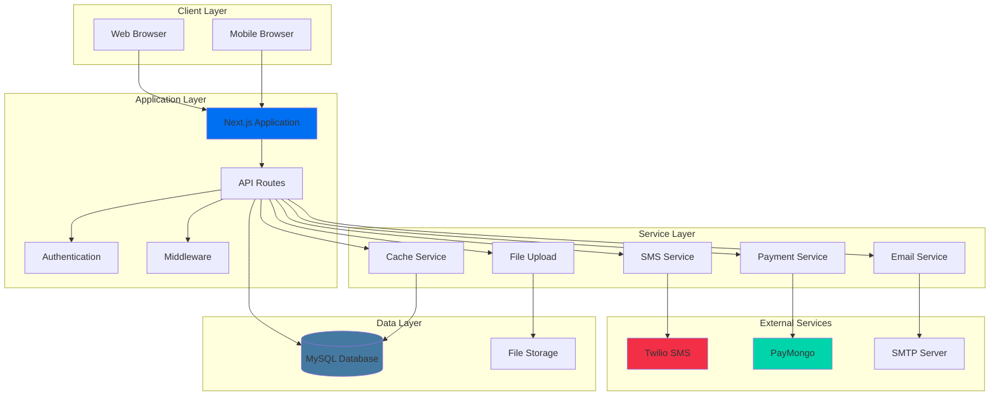

# 🐾 Rainbow Paws Application

A comprehensive Next.js application for pet memorial services, connecting pet owners with cremation service providers.

## 📋 Table of Contents

- [🐾 Overview](#-overview)
- [✨ Features](#-features)
- [🛠️ Technology Stack](#️-technology-stack)
- [🏗️ System Architecture](#️-system-architecture)
- [📋 Prerequisites](#-prerequisites)
- [⚙️ Installation & Setup](#️-installation--setup)
- [🗄️ Database Setup](#️-database-setup)
- [🚀 Running the Application](#-running-the-application)
- [📧 Email Configuration](#-email-configuration)
- [📜 Available Scripts](#-available-scripts)
- [📊 Data Flow Diagram](#-data-flow-diagram)
- [📚 API Documentation](#-api-documentation)
- [🚀 Deployment](#-deployment)
- [📁 File Organization](#-file-organization)
- [🧪 Testing](#-testing)
- [🔧 Troubleshooting](#-troubleshooting)
- [📖 Learn More](#-learn-more)
- [🤝 Contributing](#-contributing)
- [📄 License](#-license)
- [💬 Support](#-support)
- [🆕 Recent Updates](#-recent-updates-2025-07-07)

## 🐾 Overview

Rainbow Paws is a full-featured web application that facilitates pet memorial services by connecting pet owners (fur parents) with cremation service providers. The platform offers booking management, payment processing, notifications, and comprehensive dashboards for all user types.

## ✨ Features

### For Pet Owners (Fur Parents)
- 🐕 Pet profile management with photos and details
- 📅 Service booking with real-time availability
- 💳 Secure payment processing (GCash, PayMaya, Card)
- 📱 SMS and email notifications
- 📊 Booking history and status tracking
- ⭐ Review and rating system
- 🗺️ Interactive maps for service locations

### For Service Providers (Cremation Businesses)
- 🏢 Business profile and document management
- 📦 Service package creation and management
- ⏰ Availability and time slot management
- 📈 Revenue analytics and reporting
- 🔔 Real-time booking notifications
- 📋 Booking status management
- 💰 Refund processing

### For Administrators
- 👥 User and business management
- ✅ Business application approval workflow
- 📊 System analytics and monitoring
- ⚙️ Platform configuration
- 💸 Payment and refund oversight

## 🛠️ Technology Stack

- **Frontend**: Next.js 15, React 19, TypeScript
- **Styling**: Tailwind CSS, Framer Motion
- **Backend**: Next.js API Routes, Node.js
- **Database**: MySQL with connection pooling
- **Authentication**: JWT with secure HTTP-only cookies
- **Payment**: PayMongo integration
- **Notifications**: Twilio SMS, Nodemailer
- **Maps**: Leaflet with React-Leaflet
- **Validation**: Zod schema validation
- **State Management**: React Context API

## 🏗️ System Architecture



## 📋 Prerequisites

Before running the application, ensure you have:

- **Node.js** (v18 or higher) - [Download here](https://nodejs.org/)
- **npm** or **yarn** package manager (included with Node.js)
- **MySQL** database server (v8.0 or higher)
- **XAMPP** (recommended for local development) - [Download here](https://www.apachefriends.org/) or standalone MySQL

## ⚙️ Installation & Setup

### 1. Clone the Repository
```bash
# Replace 'Justin322322' with your actual GitHub username if you forked it
git clone https://github.com/Justin322322/RAINBOWPAWZ.git
cd RAINBOWPAWZ
```

> **Note**: If you downloaded this as a ZIP file, extract it and navigate to the extracted folder instead.

### 2. Install Dependencies
```bash
npm install
```

### 3. Database Setup
Start your MySQL server (XAMPP recommended for local development):
- Start Apache and MySQL in XAMPP Control Panel
- Create a database named `rainbow_paws`
- The application will automatically create tables on first run

### 4. Environment Configuration
Create a `.env.local` file in the root directory:

```bash
# Database Configuration
DB_HOST=localhost
DB_PORT=3306
DB_USER=root
DB_PASSWORD=
DB_NAME=rainbow_paws

# Application Configuration
PORT=3001
NODE_ENV=development
NEXT_PUBLIC_APP_URL=http://localhost:3001

# JWT Secret (generate a secure random string)
JWT_SECRET=your-super-secure-jwt-secret-key-here-minimum-32-characters

# Email Configuration (Optional for development)
SMTP_HOST=smtp.gmail.com
SMTP_PORT=587
SMTP_USER=your-email@gmail.com
SMTP_PASS=your-app-password
SMTP_FROM=no-reply@rainbowpaws.com
DEV_EMAIL_MODE=true

# SMS Configuration (Optional)
TWILIO_ACCOUNT_SID=your-twilio-account-sid
TWILIO_AUTH_TOKEN=your-twilio-auth-token
TWILIO_PHONE_NUMBER=your-twilio-phone-number

# Payment Configuration (Optional)
PAYMONGO_SECRET_KEY=your-paymongo-secret-key
```

## 💬 Support

### Getting Help
- 📖 Check the [documentation](#-table-of-contents) first
- 🔍 Search [existing issues](https://github.com/Justin322322/RAINBOWPAWZ/issues) for solutions
- 🆕 [Create a new issue](https://github.com/Justin322322/RAINBOWPAWZ/issues/new) if you can't find an answer

### Issue Templates
When creating an issue, please use the appropriate template:
- 🐛 [Bug Report](https://github.com/Justin322322/RAINBOWPAWZ/issues/new?template=bug_report.md)
- ✨ [Feature Request](https://github.com/Justin322322/RAINBOWPAWZ/issues/new?template=feature_request.md)
- ❓ [Question](https://github.com/Justin322322/RAINBOWPAWZ/issues/new?template=question.md)

### Community
- Email: rainbowpaws2025@gmail.com
- Facebook: [@justinmarlosibonga](https://www.facebook.com/justinmarlosibonga)

## 🆕 Recent Updates (2025-07-07)

### 📱 Mobile Responsiveness Improvements
- ✅ **Admin Dashboard**: Enhanced mobile card views for recent applications
- ✅ **User Management**: Improved mobile interface for cremation centers and fur parents
- ✅ **Admin Logs**: Fixed mobile view with custom Select components
- ✅ **Touch-Friendly Buttons**: Larger, more accessible action buttons on mobile
- ✅ **Modal Improvements**: Better mobile modal experience with proper warnings

### 🧹 Codebase Optimization
- ✅ **File Cleanup**: Removed 45+ unused legacy files and components
- ✅ **Bundle Optimization**: Reduced application size through dead code elimination
- ✅ **Build Performance**: Improved compilation speed and reduced memory usage
- ✅ **Type Safety**: Enhanced TypeScript coverage and error handling

### 🔧 Bug Fixes & Stability
- ✅ **Build Errors**: Fixed all TypeScript compilation errors
- ✅ **Mobile UX**: Resolved touch target issues and improved accessibility
- ✅ **Modal Warnings**: Ensured restriction warnings appear on all devices
- ✅ **Production Ready**: Zero-error build suitable for deployment

### 🎨 UI/UX Enhancements
- ✅ **Consistent Design**: Unified card styling across all admin pages
- ✅ **Better Navigation**: Improved mobile menu and touch interactions
- ✅ **Loading States**: Enhanced skeleton loading components
- ✅ **Responsive Tables**: Better mobile table handling with proper overflow

---

**Built with ❤️ for pet lovers everywhere**

*Rainbow Paws - Honoring the memories of our beloved companions*
