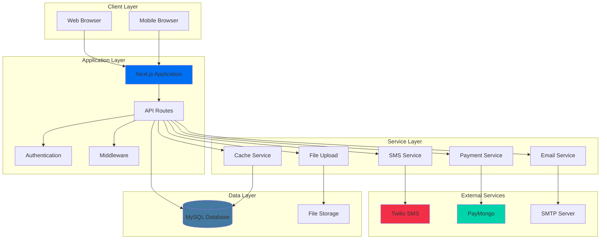

# 🌈 Rainbow Paws Application

A comprehensive Next.js application for pet memorial services, connecting pet owners with cremation service providers.

## 📋 Table of Contents

- [Overview](#overview)
- [Features](#features)
- [Technology Stack](#technology-stack)
- [System Architecture](#system-architecture)
- [Prerequisites](#prerequisites)
- [Installation & Setup](#installation--setup)
- [Environment Configuration](#environment-configuration)
- [Database Setup](#database-setup)
- [Running the Application](#running-the-application)
- [Available Scripts](#available-scripts)
- [API Documentation](#api-documentation)
- [Deployment](#deployment)
- [Recent Updates](#recent-updates)

## 🎯 Overview

Rainbow Paws is a full-featured web application that facilitates pet memorial services by connecting pet owners (fur parents) with cremation service providers. The platform offers booking management, payment processing, notifications, and comprehensive dashboards for all user types.

## ✨ Features

### For Pet Owners (Fur Parents)
- 🐾 Pet profile management with photos and details
- 📅 Service booking with real-time availability
- 💳 Secure payment processing (GCash, PayMaya, Card)
- 📱 SMS and email notifications
- 📊 Booking history and status tracking
- ⭐ Review and rating system
- 🗺️ Interactive maps for service locations

### For Service Providers (Cremation Businesses)
- 🏢 Business profile and document management
- 📦 Service package creation and management
- 🕐 Availability and time slot management
- 📈 Revenue analytics and reporting
- 🔔 Real-time booking notifications
- 📋 Booking status management
- 💰 Refund processing

### For Administrators
- 👥 User and business management
- ✅ Business application approval workflow
- 📊 System analytics and monitoring
- 🔧 Platform configuration
- 💸 Payment and refund oversight

## 🛠️ Technology Stack

- **Frontend**: Next.js 15, React 19, TypeScript
- **Styling**: Tailwind CSS, Framer Motion
- **Backend**: Next.js API Routes, Node.js
- **Database**: MySQL with connection pooling
- **Authentication**: JWT with secure HTTP-only cookies
- **Payment**: PayMongo integration
- **Notifications**: Twilio SMS, Nodemailer
- **Maps**: Leaflet with React-Leaflet
- **Validation**: Zod schema validation
- **State Management**: React Context API

## 🏗️ System Architecture



## 📋 Prerequisites

Before running the application, ensure you have:

- **Node.js** (v18 or higher)
- **npm** or **yarn** package manager
- **MySQL** database server (v8.0 or higher)
- **XAMPP** (recommended for local development) or standalone MySQL

## 🚀 Installation & Setup

### 1. Clone the Repository
```bash
git clone <repository-url>
cd RainbowPaws
```

### 2. Install Dependencies
```bash
npm install
```

### 3. Database Setup
Start your MySQL server (XAMPP recommended for local development):
- Start Apache and MySQL in XAMPP Control Panel
- Create a database named `rainbow_paws`
- The application will automatically create tables on first run

### 4. Environment Configuration
Create a `.env.local` file in the root directory:

```bash
# Database Configuration
DB_HOST=localhost
DB_PORT=3306
DB_USER=root
DB_PASSWORD=
DB_NAME=rainbow_paws

# Application Configuration
PORT=3001
NODE_ENV=development
NEXT_PUBLIC_APP_URL=http://localhost:3001

# JWT Secret (generate a secure random string)
JWT_SECRET=your-super-secure-jwt-secret-key-here-minimum-32-characters

# Email Configuration (Optional for development)
SMTP_HOST=smtp.gmail.com
SMTP_PORT=587
SMTP_USER=your-email@gmail.com
SMTP_PASS=your-app-password
SMTP_FROM=no-reply@rainbowpaws.com
DEV_EMAIL_MODE=true

# SMS Configuration (Optional)
TWILIO_ACCOUNT_SID=your-twilio-account-sid
TWILIO_AUTH_TOKEN=your-twilio-auth-token
TWILIO_PHONE_NUMBER=your-twilio-phone-number

# Payment Configuration (Optional)
PAYMONGO_SECRET_KEY=your-paymongo-secret-key
```

## 🗄️ Database Setup

### Automatic Setup (Recommended)
The application automatically creates necessary database tables on first run. Simply:

1. Ensure MySQL is running
2. Create an empty database named `rainbow_paws`
3. Start the application - tables will be created automatically

### Manual Setup (Advanced)
If you prefer manual setup, run the migration scripts in `src/lib/migrations/`:

```bash
# Navigate to migrations directory
cd src/lib/migrations

# Run migration script
node run_migrations.js
```

## 🏃‍♂️ Running the Application

### Development Mode
```bash
npm run dev
```
The application will be available at `http://localhost:3001` (or your configured PORT)

### Production Mode
```bash
# Build the application
npm run build

# Start production server
npm run start
```

### Custom Port
```bash
# Development with custom port
npx next dev -p 3005

# Production with custom port
npm run build
npx next start -p 3005
```

## 📧 Email Configuration

### Development Mode (Default)
- `DEV_EMAIL_MODE=true` - Emails are logged to console instead of being sent
- No SMTP credentials required
- OTP codes and reset tokens are displayed in server logs

### Production Mode
- `DEV_EMAIL_MODE=false` - Real emails are sent
- Requires valid SMTP credentials
- Supports Gmail, Outlook, and custom SMTP servers

### Gmail Setup
1. Enable 2-factor authentication
2. Generate an App Password
3. Use the App Password as `SMTP_PASS`

## 📜 Available Scripts

| Script | Description |
|--------|-------------|
| `npm run dev` | Start development server with hot reload |
| `npm run build` | Build optimized production bundle |
| `npm run start` | Start production server |
| `npm run lint` | Run ESLint code quality checks |
| `npm run lint:fix` | Auto-fix ESLint issues |
| `npm run lint:unused` | Check for unused imports |
| `npm run lint:unused:fix` | Remove unused imports |
| `npm run type-check` | Run TypeScript type checking |
| `npm run clean` | Clean build artifacts |
| `npm run clean:all` | Full cleanup including node_modules |
| `npm run spring-clean` | Complete cleanup with linting and type checking |

## 🔄 Data Flow Diagram

The following diagram illustrates how data flows through the Rainbow Paws application:

```mermaid
flowchart TD
    subgraph "User Interface Layer"
        UI[User Interface]
        AUTH_UI[Authentication Pages]
        DASHBOARD[Dashboard Pages]
        BOOKING_UI[Booking Interface]
    end

    subgraph "API Layer"
        AUTH_API[Authentication API]
        USER_API[User Management API]
        PET_API[Pet Management API]
        BOOKING_API[Booking API]
        PAYMENT_API[Payment API]
        NOTIFICATION_API[Notification API]
        ADMIN_API[Admin API]
    end

    subgraph "Business Logic Layer"
        AUTH_SERVICE[Authentication Service]
        BOOKING_SERVICE[Booking Service]
        PAYMENT_SERVICE[Payment Service]
        EMAIL_SERVICE[Email Service]
        SMS_SERVICE[SMS Service]
        CACHE_SERVICE[Cache Service]
    end

    subgraph "Data Access Layer"
        DB_USERS[(Users Table)]
        DB_PETS[(Pets Table)]
        DB_BOOKINGS[(Bookings Table)]
        DB_PAYMENTS[(Payments Table)]
        DB_NOTIFICATIONS[(Notifications Table)]
        DB_PROVIDERS[(Service Providers Table)]
        DB_PACKAGES[(Service Packages Table)]
    end

    subgraph "External Services"
        PAYMONGO_EXT[PayMongo API]
        TWILIO_EXT[Twilio SMS API]
        SMTP_EXT[SMTP Server]
    end

    subgraph "File Storage"
        PET_IMAGES[Pet Images]
        PACKAGE_IMAGES[Package Images]
        PROFILE_IMAGES[Profile Images]
    end

    %% User Interface to API
    UI --> AUTH_API
    AUTH_UI --> AUTH_API
    DASHBOARD --> USER_API
    DASHBOARD --> PET_API
    BOOKING_UI --> BOOKING_API
    BOOKING_UI --> PAYMENT_API

    %% API to Business Logic
    AUTH_API --> AUTH_SERVICE
    USER_API --> AUTH_SERVICE
    PET_API --> AUTH_SERVICE
    BOOKING_API --> BOOKING_SERVICE
    PAYMENT_API --> PAYMENT_SERVICE
    NOTIFICATION_API --> EMAIL_SERVICE
    NOTIFICATION_API --> SMS_SERVICE

    %% Business Logic to Data Access
    AUTH_SERVICE --> DB_USERS
    BOOKING_SERVICE --> DB_BOOKINGS
    BOOKING_SERVICE --> DB_PETS
    BOOKING_SERVICE --> DB_PROVIDERS
    BOOKING_SERVICE --> DB_PACKAGES
    PAYMENT_SERVICE --> DB_PAYMENTS
    EMAIL_SERVICE --> DB_NOTIFICATIONS
    SMS_SERVICE --> DB_NOTIFICATIONS

    %% External Service Integration
    PAYMENT_SERVICE --> PAYMONGO_EXT
    SMS_SERVICE --> TWILIO_EXT
    EMAIL_SERVICE --> SMTP_EXT

    %% File Storage
    PET_API --> PET_IMAGES
    USER_API --> PROFILE_IMAGES
    ADMIN_API --> PACKAGE_IMAGES

    %% Cache Integration
    AUTH_SERVICE --> CACHE_SERVICE
    BOOKING_SERVICE --> CACHE_SERVICE

    %% Styling
    style UI fill:#e1f5fe
    style AUTH_API fill:#f3e5f5
    style BOOKING_SERVICE fill:#e8f5e8
    style DB_USERS fill:#fff3e0
    style PAYMONGO_EXT fill:#ffebee
    style PET_IMAGES fill:#f1f8e9
```



## 🔌 API Documentation

### Authentication Endpoints
- `POST /api/auth/register` - User registration
- `POST /api/auth/login` - User login
- `POST /api/auth/logout` - User logout
- `GET /api/auth/check` - Check authentication status

### User Management
- `GET /api/users` - Get user profile
- `PUT /api/users` - Update user profile
- `POST /api/users/upload-profile-picture` - Upload profile picture

### Pet Management
- `GET /api/pets` - Get user's pets
- `POST /api/pets` - Create new pet
- `GET /api/pets/[id]` - Get specific pet
- `PUT /api/pets/[id]` - Update pet information
- `DELETE /api/pets/[id]` - Delete pet

### Booking System
- `GET /api/cremation/bookings` - Get user bookings
- `POST /api/cremation/bookings` - Create new booking
- `GET /api/cremation/bookings/[id]` - Get booking details
- `PUT /api/cremation/bookings/[id]` - Update booking
- `POST /api/cremation/bookings/[id]/cancel` - Cancel booking

### Payment Processing
- `POST /api/payments/create-intent` - Create payment intent
- `GET /api/payments/status` - Check payment status
- `POST /api/payments/webhook` - Payment webhook handler

## 🚀 Deployment

### Production Build
```bash
# Install dependencies
npm install

# Build the application
npm run build

# Start production server
npm run start
```

### Environment Variables for Production
Ensure all required environment variables are set:
- Database credentials
- JWT secret (minimum 32 characters)
- SMTP configuration (if email features needed)
- Payment gateway credentials (if payment features needed)

### Docker Deployment (Optional)
```dockerfile
FROM node:18-alpine
WORKDIR /app
COPY package*.json ./
RUN npm ci --only=production
COPY . .
RUN npm run build
EXPOSE 3001
CMD ["npm", "start"]
```

## 🗂️ File Organization

### Package Images
Images for service packages are organized in a structured folder system:
- **Path Format**: `/public/uploads/packages/{packageId}/{filename}`
- **Auto-creation**: Folders are created automatically when uploading
- **Database Integration**: Paths are stored and managed in the database

### Pet Images
Pet profile pictures are stored in:
- **Path Format**: `/public/uploads/pets/{userId}/{filename}`
- **Supported Formats**: JPG, PNG, WebP
- **Size Limits**: Maximum 5MB per image

### Profile Pictures
User and business profile pictures:
- **Path Format**: `/public/uploads/profiles/{userType}/{userId}/{filename}`
- **Types**: `users`, `businesses`, `admins`

## 🧪 Testing

### Running Tests
```bash
# Run all tests
npm test

# Run tests in watch mode
npm run test:watch

# Run tests with coverage
npm run test:coverage
```

### Test Structure
- **Unit Tests**: Component and utility function tests
- **Integration Tests**: API endpoint tests
- **E2E Tests**: Full user workflow tests

## 🔧 Troubleshooting

### Common Issues

#### Database Connection Failed
```bash
Error: Database connection failed
```
**Solution**:
1. Ensure MySQL is running
2. Check database credentials in `.env.local`
3. Verify database `rainbow_paws` exists

#### Port Already in Use
```bash
Error: Port 3001 is already in use
```
**Solution**:
```bash
# Use different port
npx next dev -p 3002

# Or kill process using the port
npx kill-port 3001
```

#### JWT Secret Error
```bash
Error: JWT secret must be at least 32 characters
```
**Solution**: Generate a secure JWT secret:
```bash
# Generate random string
node -e "console.log(require('crypto').randomBytes(32).toString('hex'))"
```

### Development Tips
- Use browser dev tools for debugging
- Check server logs for API errors
- Monitor database queries in development mode
- Use React Developer Tools for component debugging

## 📚 Learn More

### Next.js Resources
- [Next.js Documentation](https://nextjs.org/docs) - Learn about Next.js features and API
- [Learn Next.js](https://nextjs.org/learn) - Interactive Next.js tutorial
- [Next.js GitHub](https://github.com/vercel/next.js/) - Source code and examples

### Technology Documentation
- [React Documentation](https://react.dev/) - React library documentation
- [Tailwind CSS](https://tailwindcss.com/docs) - Utility-first CSS framework
- [TypeScript](https://www.typescriptlang.org/docs/) - TypeScript language documentation
- [MySQL](https://dev.mysql.com/doc/) - MySQL database documentation

## 🤝 Contributing

1. Fork the repository
2. Create a feature branch (`git checkout -b feature/amazing-feature`)
3. Commit your changes (`git commit -m 'Add some amazing feature'`)
4. Push to the branch (`git push origin feature/amazing-feature`)
5. Open a Pull Request

### Code Style
- Follow TypeScript best practices
- Use Tailwind CSS for styling
- Write meaningful commit messages
- Add tests for new features
- Update documentation as needed

## 📄 License

This project is licensed under the MIT License - see the [LICENSE](LICENSE) file for details.

## 📞 Support

For support and questions:
- Create an issue in the repository
- Check existing documentation
- Review troubleshooting section

## 🎉 Recent Updates (2025-06-26)

✨ **Codebase Cleanup Completed**:
- Comprehensive cleanup reducing dependencies by 26%
- Eliminated dead code for improved performance
- Enhanced maintainability and code organization
- See [CLEANUP_SUMMARY.md](./CLEANUP_SUMMARY.md) for detailed changes

---

**Built with ❤️ for pet memorial services**
