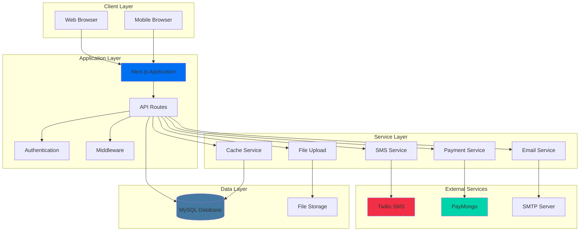
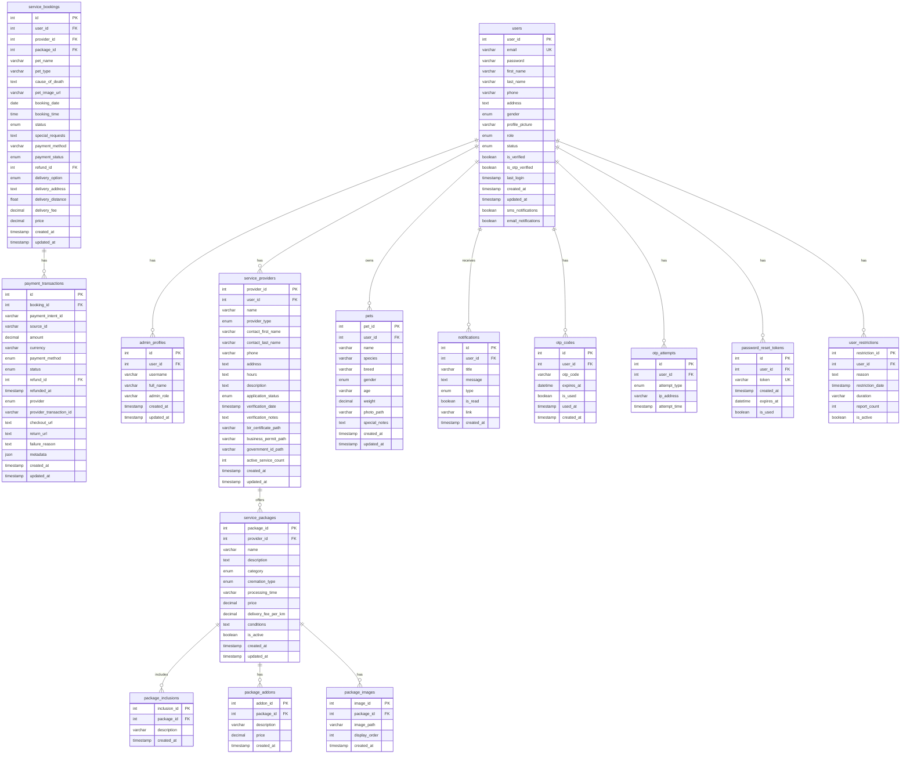

# Rainbow Paws Application

A comprehensive Next.js application for pet memorial services, connecting pet owners with cremation service providers.

## Table of Contents

- [Overview](#overview)
- [Features](#features)
- [Technology Stack](#technology-stack)
- [System Architecture](#system-architecture)
- [Prerequisites](#prerequisites)
- [Installation & Setup](#installation--setup)
- [Database Setup](#database-setup)
- [Running the Application](#running-the-application)
- [Email Configuration](#email-configuration)
- [Available Scripts](#available-scripts)
- [Data Flow Diagram](#data-flow-diagram)
- [API Documentation](#api-documentation)
- [Deployment](#deployment)
- [File Organization](#file-organization)
- [Testing](#testing)
- [Troubleshooting](#troubleshooting)
- [Learn More](#learn-more)
- [Contributing](#contributing)
- [License](#license)
- [Support](#support)
- [Recent Updates](#recent-updates-2025-07-07)

## Overview

Rainbow Paws is a full-featured web application that facilitates pet memorial services by connecting pet owners (fur parents) with cremation service providers. The platform offers booking management, payment processing, notifications, and comprehensive dashboards for all user types.

## Features

### For Pet Owners (Fur Parents)
- Pet profile management with photos and details
- Service booking with real-time availability
- Secure payment processing (GCash, PayMaya, Card)
- SMS and email notifications
- Booking history and status tracking
- Review and rating system
- Interactive maps for service locations

### For Service Providers (Cremation Businesses)
- Business profile and document management
- Service package creation and management
- Availability and time slot management
- Revenue analytics and reporting
- Real-time booking notifications
- Booking status management
- Refund processing

### For Administrators
- User and business management
- Business application approval workflow
- System analytics and monitoring
- Platform configuration
- Payment and refund oversight

## Technology Stack

- **Frontend**: Next.js 15, React 19, TypeScript
- **Styling**: Tailwind CSS, Framer Motion
- **Backend**: Next.js API Routes, Node.js
- **Database**: MySQL with connection pooling
- **Authentication**: JWT with secure HTTP-only cookies
- **Payment**: PayMongo integration
- **Notifications**: Twilio SMS, Nodemailer
- **Maps**: Leaflet with React-Leaflet
- **Validation**: Zod schema validation
- **State Management**: React Context API

## System Architecture



## Prerequisites

Before running the application, ensure you have:

- **Node.js** (v18 or higher) - [Download here](https://nodejs.org/)
- **npm** or **yarn** package manager (included with Node.js)
- **MySQL** database server (v8.0 or higher)
- **XAMPP** (recommended for local development) - [Download here](https://www.apachefriends.org/) or standalone MySQL

## Installation & Setup

### 1. Clone the Repository
```bash
# Replace 'Justin322322' with your actual GitHub username if you forked it
git clone https://github.com/Justin322322/RAINBOWPAWZ.git
cd RAINBOWPAWZ
```

> **Note**: If you downloaded this as a ZIP file, extract it and navigate to the extracted folder instead.

### 2. Install Dependencies
```bash
npm install
```

### 3. Database Setup
Start your MySQL server (XAMPP recommended for local development):
- Start Apache and MySQL in XAMPP Control Panel
- Create a database named `rainbow_paws`
- The application will automatically create tables on first run

### 4. Environment Configuration
Create a `.env.local` file in the root directory:

```bash
# Database Configuration
DB_HOST=localhost
DB_PORT=3306
DB_USER=root
DB_PASSWORD=
DB_NAME=rainbow_paws

# Application Configuration
PORT=3001
NODE_ENV=development
NEXT_PUBLIC_APP_URL=http://localhost:3001

# JWT Secret (generate a secure random string)
JWT_SECRET=your-super-secure-jwt-secret-key-here-minimum-32-characters

# Email Configuration (Optional for development)
SMTP_HOST=smtp.gmail.com
SMTP_PORT=587
SMTP_USER=your-email@gmail.com
SMTP_PASS=your-app-password
SMTP_FROM=no-reply@rainbowpaws.com
DEV_EMAIL_MODE=true

# SMS Configuration (Optional)
TWILIO_ACCOUNT_SID=your-twilio-account-sid
TWILIO_AUTH_TOKEN=your-twilio-auth-token
TWILIO_PHONE_NUMBER=your-twilio-phone-number

# Payment Configuration (Optional)
PAYMONGO_SECRET_KEY=your-paymongo-secret-key
```

## Database Setup

### Database Schema (ERD)

The Rainbow Paws application uses a comprehensive MySQL database schema designed to handle all aspects of pet memorial services. The database has been optimized and cleaned of any corrupted data. Below is the Entity Relationship Diagram showing the complete database structure:



### Key Database Features

#### Core Entities (with Foreign Key Relationships)
- **Users**: Central user management with role-based access (fur_parent, business, admin)
- **Service Providers**: Cremation businesses with verification workflow (linked to users)
- **Service Packages**: Customizable service offerings with pricing and inclusions (linked to providers)
- **Pets**: Pet profiles with detailed information and photos (linked to users)
- **Service Bookings**: Main booking system for cremation services
- **Payment Transactions**: Payment processing system (linked to service_bookings)

#### Security & Authentication
- **OTP System**: Secure email verification with attempt tracking
- **Password Reset**: Token-based password recovery
- **Rate Limiting**: API protection against abuse
- **User Restrictions**: Admin-controlled user access management

#### Payment & Financial
- **Payment Transactions**: Complete payment processing with PayMongo integration
- **Refunds**: Automated refund processing with admin oversight
- **Multiple Payment Methods**: Support for GCash, PayMaya, and card payments

#### Communication & Notifications
- **Email System**: Queue-based email delivery with logging
- **Notifications**: Real-time user notifications with read status
- **Admin Notifications**: Separate notification system for administrators
- **Admin Logs**: Comprehensive audit trail for all admin actions

#### Business Logic
- **Provider Availability**: Calendar-based availability management
- **Time Slots**: Detailed scheduling with service-specific availability
- **Reviews**: Rating system with expiration dates
- **Package Management**: Flexible service packages with addons and images

#### Tables Not Shown in ERD
The following tables exist in the database but are excluded from the ERD as they lack foreign key constraints:
- **Admin Logs**: Audit trail for admin actions (optimized)
- **Admin Notifications**: Admin-specific notifications
- **Email Queue/Log**: Email delivery and tracking system (optimized)
- **Rate Limits**: API rate limiting protection (optimized)
- **Reviews**: Customer feedback and rating system
- **Refunds**: Payment refund management
- **Provider Availability/Time Slots**: Scheduling and availability system
- **User Appeals**: Appeal system for restricted users
- **Appeal History**: Tracking of appeal status changes
- **Business Notifications**: Business-specific notifications
- **Migration History**: Database migration tracking

### Automatic Setup (Recommended)
The application automatically creates necessary database tables on first run. The included SQL file has been cleaned and optimized for production use. Simply:

1. Ensure MySQL is running
2. Create an empty database named `rainbow_paws`
3. Import the provided `rainbow_paws.sql` file, or
4. Start the application - tables will be created automatically

**Note**: The database has been cleaned of corrupted data and optimized for performance.

### Manual Setup (Advanced)
If you prefer manual setup, run the migration scripts in `src/lib/migrations/`:

```bash
# Navigate to migrations directory
cd src/lib/migrations

# Run migration script
node run_migrations.js
```

## Running the Application

### Development Mode
```bash
npm run dev
```
The application will be available at `http://localhost:3001` (or your configured PORT)

### Production Mode
```bash
# Build the application
npm run build

# Start production server
npm run start
```

### Custom Port
```bash
# Development with custom port
npx next dev -p 3005

# Production with custom port
npm run build
npx next start -p 3005
```

## Email Configuration

### Development Mode (Default)
- `DEV_EMAIL_MODE=true` - Emails are logged to console instead of being sent
- No SMTP credentials required
- OTP codes and reset tokens are displayed in server logs

### Production Mode
- `DEV_EMAIL_MODE=false` - Real emails are sent
- Requires valid SMTP credentials
- Supports Gmail, Outlook, and custom SMTP servers

### Gmail Setup
1. Enable 2-factor authentication in your [Google Account Security](https://myaccount.google.com/security)
2. Generate an [App Password](https://support.google.com/accounts/answer/185833)
3. Use the App Password as `SMTP_PASS` in your `.env.local` file

> **Note**: Regular Gmail passwords won't work for SMTP. You must use an App Password.

## Available Scripts

| Script | Description |
|--------|-------------|
| `npm run dev` | Start development server with hot reload |
| `npm run build` | Build optimized production bundle |
| `npm run start` | Start production server |
| `npm run lint` | Run ESLint code quality checks |
| `npm run lint:fix` | Auto-fix ESLint issues |
| `npm run lint:unused` | Check for unused imports |
| `npm run lint:unused:fix` | Remove unused imports |
| `npm run type-check` | Run TypeScript type checking |
| `npm run clean` | Clean build artifacts |
| `npm run clean:all` | Full cleanup including node_modules |
| `npm run spring-clean` | Complete cleanup with linting and type checking |

## Data Flow Diagram

The following Data Flow Diagram illustrates how data flows through the Rainbow Paws application across different layers and components:

```mermaid
flowchart TD
    subgraph "External Actors"
        FP[Fur Parents]
        SP[Service Providers]
        AD[Administrators]
        GU[Guest Users]
    end

    subgraph "User Interface Layer"
        WEB[Web Application]
        AUTH_UI[Authentication Pages]
        DASH[User Dashboard]
        ADMIN_UI[Admin Dashboard]
        BOOKING_UI[Booking Interface]
        PAYMENT_UI[Payment Interface]
    end

    subgraph "API Gateway Layer"
        API_ROUTER[API Router]
        AUTH_MW[Auth Middleware]
        RATE_LIMIT[Rate Limiter]
        VALIDATOR[Request Validator]
    end

    subgraph "Business Logic Layer"
        AUTH_SVC[Authentication Service]
        USER_SVC[User Management Service]
        PET_SVC[Pet Management Service]
        BOOKING_SVC[Booking Service]
        PAYMENT_SVC[Payment Service]
        NOTIFICATION_SVC[Notification Service]
        ADMIN_SVC[Admin Service]
        FILE_SVC[File Upload Service]
    end

    subgraph "Data Access Layer"
        USER_REPO[User Repository]
        PET_REPO[Pet Repository]
        BOOKING_REPO[Booking Repository]
        PAYMENT_REPO[Payment Repository]
        PROVIDER_REPO[Provider Repository]
        NOTIFICATION_REPO[Notification Repository]
    end

    subgraph "Database Layer"
        MYSQL[(MySQL Database)]
        CACHE[(Redis Cache)]
    end

    subgraph "External Services"
        PAYMONGO[PayMongo API]
        TWILIO[Twilio SMS]
        SMTP[SMTP Server]
        STORAGE[File Storage]
    end

    subgraph "Data Stores"
        USER_DATA[User Data]
        PET_DATA[Pet Profiles]
        BOOKING_DATA[Booking Records]
        PAYMENT_DATA[Payment Transactions]
        PROVIDER_DATA[Service Providers]
        NOTIFICATION_DATA[Notifications]
        FILE_DATA[Uploaded Files]
    end

    %% External Actors to UI
    FP --> WEB
    SP --> WEB
    AD --> ADMIN_UI
    GU --> AUTH_UI

    %% UI Layer to API Gateway
    WEB --> API_ROUTER
    AUTH_UI --> API_ROUTER
    DASH --> API_ROUTER
    ADMIN_UI --> API_ROUTER
    BOOKING_UI --> API_ROUTER
    PAYMENT_UI --> API_ROUTER

    %% API Gateway Processing
    API_ROUTER --> AUTH_MW
    AUTH_MW --> RATE_LIMIT
    RATE_LIMIT --> VALIDATOR

    %% API Gateway to Business Logic
    VALIDATOR --> AUTH_SVC
    VALIDATOR --> USER_SVC
    VALIDATOR --> PET_SVC
    VALIDATOR --> BOOKING_SVC
    VALIDATOR --> PAYMENT_SVC
    VALIDATOR --> NOTIFICATION_SVC
    VALIDATOR --> ADMIN_SVC
    VALIDATOR --> FILE_SVC

    %% Business Logic to Data Access
    AUTH_SVC --> USER_REPO
    USER_SVC --> USER_REPO
    PET_SVC --> PET_REPO
    BOOKING_SVC --> BOOKING_REPO
    BOOKING_SVC --> PROVIDER_REPO
    PAYMENT_SVC --> PAYMENT_REPO
    NOTIFICATION_SVC --> NOTIFICATION_REPO
    ADMIN_SVC --> USER_REPO
    ADMIN_SVC --> BOOKING_REPO
    FILE_SVC --> STORAGE

    %% Data Access to Database
    USER_REPO --> MYSQL
    PET_REPO --> MYSQL
    BOOKING_REPO --> MYSQL
    PAYMENT_REPO --> MYSQL
    PROVIDER_REPO --> MYSQL
    NOTIFICATION_REPO --> MYSQL

    %% Cache Integration
    AUTH_SVC --> CACHE
    USER_SVC --> CACHE
    BOOKING_SVC --> CACHE

    %% External Service Integration
    PAYMENT_SVC --> PAYMONGO
    NOTIFICATION_SVC --> TWILIO
    NOTIFICATION_SVC --> SMTP

    %% Database to Data Stores
    MYSQL --> USER_DATA
    MYSQL --> PET_DATA
    MYSQL --> BOOKING_DATA
    MYSQL --> PAYMENT_DATA
    MYSQL --> PROVIDER_DATA
    MYSQL --> NOTIFICATION_DATA
    STORAGE --> FILE_DATA

    %% Data Flow Styling
    classDef userLayer fill:#e1f5fe,stroke:#01579b,stroke-width:2px
    classDef apiLayer fill:#f3e5f5,stroke:#4a148c,stroke-width:2px
    classDef businessLayer fill:#e8f5e8,stroke:#1b5e20,stroke-width:2px
    classDef dataLayer fill:#fff3e0,stroke:#e65100,stroke-width:2px
    classDef externalLayer fill:#ffebee,stroke:#b71c1c,stroke-width:2px
    classDef storageLayer fill:#f1f8e9,stroke:#33691e,stroke-width:2px

    class WEB,AUTH_UI,DASH,ADMIN_UI,BOOKING_UI,PAYMENT_UI userLayer
    class API_ROUTER,AUTH_MW,RATE_LIMIT,VALIDATOR apiLayer
    class AUTH_SVC,USER_SVC,PET_SVC,BOOKING_SVC,PAYMENT_SVC,NOTIFICATION_SVC,ADMIN_SVC,FILE_SVC businessLayer
    class USER_REPO,PET_REPO,BOOKING_REPO,PAYMENT_REPO,PROVIDER_REPO,NOTIFICATION_REPO,MYSQL,CACHE dataLayer
    class PAYMONGO,TWILIO,SMTP,STORAGE externalLayer
    class USER_DATA,PET_DATA,BOOKING_DATA,PAYMENT_DATA,PROVIDER_DATA,NOTIFICATION_DATA,FILE_DATA storageLayer
```



### Data Flow Process Description

**1. User Interaction Flow**
- External actors (Fur Parents, Service Providers, Admins) interact with the web application
- Requests flow through the UI layer to the API Gateway
- API Gateway handles authentication, rate limiting, and request validation

**2. Business Logic Processing**
- Validated requests are processed by appropriate business services
- Services implement core business rules and workflows
- Cross-service communication handles complex operations

**3. Data Persistence**
- Business services interact with data repositories
- Repositories abstract database operations
- Data is stored in MySQL with Redis caching for performance

**4. External Integration**
- Payment processing through PayMongo API
- SMS notifications via Twilio
- Email delivery through SMTP servers
- File storage for images and documents

**5. Response Flow**
- Data flows back through the same layers
- Responses are formatted and returned to the UI
- Real-time updates via notifications and cache invalidation

## API Documentation

### Authentication Endpoints
- `POST /api/auth/register` - User registration
- `POST /api/auth/login` - User login
- `POST /api/auth/logout` - User logout
- `GET /api/auth/check` - Check authentication status

### User Management
- `GET /api/users` - Get user profile
- `PUT /api/users` - Update user profile
- `POST /api/users/upload-profile-picture` - Upload profile picture

### Pet Management
- `GET /api/pets` - Get user's pets
- `POST /api/pets` - Create new pet
- `GET /api/pets/[id]` - Get specific pet
- `PUT /api/pets/[id]` - Update pet information
- `DELETE /api/pets/[id]` - Delete pet

### Booking System
- `GET /api/cremation/bookings` - Get user bookings
- `POST /api/cremation/bookings` - Create new booking
- `GET /api/cremation/bookings/[id]` - Get booking details
- `PUT /api/cremation/bookings/[id]` - Update booking
- `POST /api/cremation/bookings/[id]/cancel` - Cancel booking

### Payment Processing
- `POST /api/payments/create-intent` - Create payment intent
- `GET /api/payments/status` - Check payment status
- `POST /api/payments/webhook` - Payment webhook handler

## Deployment

### Production Build
```bash
# Install dependencies
npm install

# Build the application
npm run build

# Start production server
npm run start
```

### Environment Variables for Production
Ensure all required environment variables are set:
- Database credentials
- JWT secret (minimum 32 characters)
- SMTP configuration (if email features needed)
- Payment gateway credentials (if payment features needed)

### Docker Deployment (Optional)
```dockerfile
FROM node:18-alpine
WORKDIR /app
COPY package*.json ./
RUN npm ci --only=production
COPY . .
RUN npm run build
EXPOSE 3001
CMD ["npm", "start"]
```

## File Organization

### Package Images
Images for service packages are organized in a structured folder system:
- **Path Format**: `/public/uploads/packages/{packageId}/{filename}`
- **Auto-creation**: Folders are created automatically when uploading
- **Database Integration**: Paths are stored and managed in the database

### Pet Images
Pet profile pictures are stored in:
- **Path Format**: `/public/uploads/pets/{userId}/{filename}`
- **Supported Formats**: JPG, PNG, WebP
- **Size Limits**: Maximum 5MB per image

### Profile Pictures
User and business profile pictures:
- **Path Format**: `/public/uploads/profiles/{userType}/{userId}/{filename}`
- **Types**: `users`, `businesses`, `admins`

## Testing

### Running Tests
```bash
# Run all tests
npm test

# Run tests in watch mode
npm run test:watch

# Run tests with coverage
npm run test:coverage
```

### Test Structure
- **Unit Tests**: Component and utility function tests
- **Integration Tests**: API endpoint tests
- **E2E Tests**: Full user workflow tests

## Troubleshooting

### Common Issues

#### Database Connection Failed
```bash
Error: Database connection failed
```
**Solution**:
1. Ensure MySQL is running
2. Check database credentials in `.env.local`
3. Verify database `rainbow_paws` exists

#### Port Already in Use
```bash
Error: Port 3001 is already in use
```
**Solution**:
```bash
# Use different port
npx next dev -p 3002

# Or kill process using the port
npx kill-port 3001
```

#### JWT Secret Error
```bash
Error: JWT secret must be at least 32 characters
```
**Solution**: Generate a secure JWT secret:
```bash
# Generate random string
node -e "console.log(require('crypto').randomBytes(32).toString('hex'))"
```

Or use an online generator: [JWT Secret Generator](https://generate-secret.vercel.app/32)

### Development Tips
- Use browser dev tools for debugging
- Check server logs for API errors
- Monitor database queries in development mode
- Use React Developer Tools for component debugging

## Learn More

### Next.js Resources
- [Next.js Documentation](https://nextjs.org/docs) - Learn about Next.js features and API
- [Learn Next.js](https://nextjs.org/learn) - Interactive Next.js tutorial
- [Next.js GitHub](https://github.com/vercel/next.js/) - Source code and examples

### Technology Documentation
- [React Documentation](https://react.dev/) - React library documentation
- [Tailwind CSS](https://tailwindcss.com/docs) - Utility-first CSS framework
- [TypeScript](https://www.typescriptlang.org/docs/) - TypeScript language documentation
- [MySQL](https://dev.mysql.com/doc/) - MySQL database documentation

### External Services Documentation
- [PayMongo API Documentation](https://developers.paymongo.com/) - Payment processing integration
- [Twilio Documentation](https://www.twilio.com/docs) - SMS and communication services
- [Leaflet Documentation](https://leafletjs.com/) - Interactive maps library
- [Framer Motion](https://www.framer.com/motion/) - Animation library documentation

## Contributing

We welcome contributions! Here's how to get started:

1. [Fork the repository](https://github.com/Justin322322/RAINBOWPAWZ/fork)
2. Create a feature branch (`git checkout -b feature/amazing-feature`)
3. Commit your changes (`git commit -m 'Add some amazing feature'`)
4. Push to the branch (`git push origin feature/amazing-feature`)
5. [Open a Pull Request](https://github.com/Justin322322/RAINBOWPAWZ/compare)

### Development Guidelines
- Follow the existing code style and conventions
- Write clear, descriptive commit messages
- Add tests for new features
- Update documentation as needed
- Ensure all tests pass before submitting

### Code of Conduct
Please read our [Code of Conduct](CODE_OF_CONDUCT.md) before contributing.

## License

This project is licensed under the MIT License - see the [LICENSE](LICENSE) file for details.

## Support

### Getting Help
- Check the [documentation](#table-of-contents) first
- Search [existing issues](https://github.com/Justin322322/RAINBOWPAWZ/issues) for solutions
- [Create a new issue](https://github.com/Justin322322/RAINBOWPAWZ/issues/new) if you can't find an answer

### Issue Templates
When creating an issue, please use the appropriate template:
- [Bug Report](https://github.com/Justin322322/RAINBOWPAWZ/issues/new?template=bug_report.md)
- [Feature Request](https://github.com/Justin322322/RAINBOWPAWZ/issues/new?template=feature_request.md)
- [Question](https://github.com/Justin322322/RAINBOWPAWZ/issues/new?template=question.md)

### Community
- Email: rainbowpaws2025@gmail.com
- Facebook: [@justinmarlosibonga](https://www.facebook.com/justinmarlosibonga)

## Recent Updates (2025-07-07)

### Mobile Responsiveness Improvements
- **Admin Dashboard**: Enhanced mobile card views for recent applications
- **User Management**: Improved mobile interface for cremation centers and fur parents
- **Admin Logs**: Fixed mobile view with custom Select components
- **Touch-Friendly Buttons**: Larger, more accessible action buttons on mobile
- **Modal Improvements**: Better mobile modal experience with proper warnings

### Codebase Optimization
- **File Cleanup**: Removed 45+ unused legacy files and components
- **Bundle Optimization**: Reduced application size through dead code elimination
- **Build Performance**: Improved compilation speed and reduced memory usage
- **Type Safety**: Enhanced TypeScript coverage and error handling

### Bug Fixes & Stability
- **Build Errors**: Fixed all TypeScript compilation errors
- **Mobile UX**: Resolved touch target issues and improved accessibility
- **Modal Warnings**: Ensured restriction warnings appear on all devices
- **Production Ready**: Zero-error build suitable for deployment

### UI/UX Enhancements
- **Consistent Design**: Unified card styling across all admin pages
- **Better Navigation**: Improved mobile menu and touch interactions
- **Loading States**: Enhanced skeleton loading components
- **Responsive Tables**: Better mobile table handling with proper overflow

---

**Built with care for pet lovers everywhere**

*Rainbow Paws - Honoring the memories of our beloved companions*
