# RainbowPaws Application - Complete Process Analysis

## Table of Contents

1. [Overview](#overview)
2. [Authentication & Authorization System](#1-authentication--authorization-system)
3. [User Management & Profiles](#2-user-management--profiles)
4. [Business/Service Provider System](#3-businessservice-provider-system)
5. [Pet Management System](#4-pet-management-system)
6. [Booking & Reservation System](#5-booking--reservation-system)
7. [Payment Processing System](#6-payment-processing-system)
8. [Refund Management System](#7-refund-management-system)
9. [Notification System](#8-notification-system)
10. [Admin Management System](#9-admin-management-system)
11. [File Upload & Image Management](#10-file-upload--image-management)
12. [Review & Appeals System](#11-review--appeals-system)
13. [Shared Utilities & Infrastructure](#12-shared-utilities--infrastructure)

---

## Overview

RainbowPaws is a comprehensive Next.js pet memorial service platform connecting pet owners (fur parents) with cremation service providers. The application features role-based access control, real-time notifications, payment processing, and complex business workflows.

**Architecture:** Next.js 15+ with App Router, TypeScript, MySQL, PayMongo integration, Server-Sent Events (SSE) for real-time features.

**User Roles:** 
- `user`/`fur_parent` - Pet owners booking services
- `business` - Cremation service providers  
- `admin` - Platform administrators

---

## 1. Authentication & Authorization System

### Current Implementation Status: ✅ FULLY IMPLEMENTED

The authentication system is complete with full user registration, login, and role-based access control.

### HTTP Endpoints

| Method | Endpoint | Purpose | Status |
|--------|----------|---------|---------|
| POST | `/api/auth/login` | User login with role detection | ✅ Active |
| POST | `/api/auth/register` | Multi-type registration (personal/business) | ✅ Active |
| POST | `/api/auth/logout` | Session cleanup and token invalidation | ✅ Active |
| POST | `/api/auth/forgot-password` | Initiate password reset flow | ✅ Active |
| POST | `/api/auth/reset-password` | Complete password reset with token | ✅ Active |
| GET | `/api/auth/check` | Verify authentication status | ✅ Active |
| GET | `/api/auth/check-user-status` | User-specific auth validation | ✅ Active |
| GET | `/api/auth/check-business-status` | Business-specific auth validation | ✅ Active |
| POST | `/api/auth/otp/generate` | Generate email verification OTP | ✅ Active |
| POST | `/api/auth/otp/verify` | Verify email OTP code | ✅ Active |

### Registration Flow - FULLY FUNCTIONAL

The registration system includes:
- **Homepage Integration**: Registration modals accessible from main page (`/`)
- **Multi-Step Modal Flow**: SignupOptionModal → PersonalAccountModal/BusinessAccountModal
- **Complete Form Validation**: Password strength, email validation, required fields
- **Document Upload**: Business registration includes document verification
- **Automatic Notifications**: Welcome emails and in-app notifications
- **Immediate Dashboard Access**: Auto-redirect after successful registration

### File Structure & Responsibilities

#### **Route Protection & Middleware**
- **`src/middleware.ts`**
  - **Purpose**: Edge runtime route protection and image serving
  - **Process**: JWT decoding, role-based path validation, redirect logic
  - **Protected Routes**: `/admin/*` → admin, `/cremation/*` → business, `/user/*` → user
  - **Image Rewriting**: `/uploads/*` → `/api/image/*` for consistent serving

#### **Core Authentication Logic**
- **`src/lib/secureAuth.ts`**
  - **Purpose**: Server-side authentication verification for API routes
  - **Process**: Token extraction, JWT validation, user data parsing
  - **Returns**: `{userId, accountType}` or `null` for unauthorized requests

- **`src/utils/auth.ts`**
  - **Purpose**: Token parsing and validation utilities
  - **Functions**: `getAuthTokenFromRequest()`, `parseAuthToken()`, `fastAuthCheck()`

- **`src/lib/jwt.ts`**
  - **Purpose**: JWT token generation and validation
  - **Functions**: `generateToken()`, `verifyToken()`, `decodeTokenUnsafe()`

#### **API Route Handlers**
- **`src/app/api/auth/login/route.ts`**
  - **Process**: 
    1. Validate credentials against database
    2. Check user status and restrictions
    3. Generate JWT tokens (secure + legacy)
    4. Set HTTP-only authentication cookies
    5. Return user data with account type

- **`src/app/api/auth/register/route.ts`**
  - **Process**:
    1. Validate registration data (personal vs business)
    2. Hash passwords with bcrypt
    3. Create user record with role assignment
    4. Generate OTP for email verification (except cremation centers)
    5. Create business profiles if applicable
    6. Set authentication cookies and return success

#### **UI Components**
- **`src/components/LoginModal.tsx`** - Login interface with role detection
- **`src/components/PersonalAccountModal.tsx`** - Personal account registration form
- **`src/components/BusinessAccountModal.tsx`** - Business registration with document upload
- **`src/components/OTPVerificationModal.tsx`** - Email verification interface
- **`src/components/ForgotPasswordModal.tsx`** - Password reset initiation

#### **Higher-Order Components (HOCs)**
- **`src/components/withUserAuth.tsx`** - Protects user/fur_parent routes
- **`src/components/withAdminAuth.tsx`** - Protects admin routes  
- **`src/components/withBusinessVerification.tsx`** - Protects business routes

### End-to-End Authentication Flow

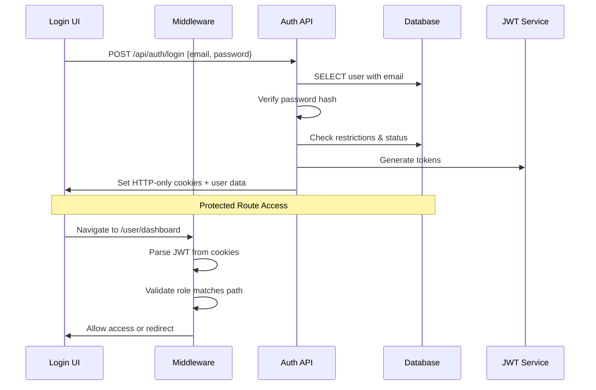

### Database Tables
- **`users`** - Core user accounts with roles and status
- **`otp_codes`** - Email verification codes with expiration
- **`password_reset_tokens`** - Secure password reset tokens
- **`rate_limits`** - API abuse prevention records

---

## 2. User Management & Profiles

### HTTP Endpoints

| Method | Endpoint | Purpose |
|--------|----------|---------|
| GET | `/api/users` | Get current user profile |
| PUT | `/api/users` | Update user profile information |
| GET | `/api/users/[id]` | Get specific user details (admin) |
| PUT | `/api/users/[id]` | Update specific user (admin) |
| PUT | `/api/users/[id]/role` | Change user role (admin) |
| PUT | `/api/users/[id]/status` | Update user status (admin) |
| POST | `/api/users/upload-profile-picture` | Upload user avatar |
| PUT | `/api/users/update-address` | Update user location |
| GET | `/api/users/notification-preferences` | Get notification settings |
| PUT | `/api/users/notification-preferences` | Update notification settings |

### File Structure & Responsibilities

#### **Core User Management**
- **`src/app/api/users/route.ts`**
  - **GET Process**: 
    1. Verify authentication via `verifySecureAuth()`
    2. Query user data from database
    3. Return profile information
  - **PUT Process**:
    1. Validate updated fields
    2. Update user record in database
    3. Return success confirmation

- **`src/app/api/users/[id]/route.ts`**
  - **Purpose**: Admin-only individual user management
  - **Process**: Role verification, user lookup, CRUD operations

#### **Specialized User Operations**
- **`src/app/api/users/upload-profile-picture/route.ts`**
  - **Process**:
    1. Validate file type and size (5MB max)
    2. Convert to base64 for database storage
    3. Update user profile_picture field
    4. Return image data URL

- **`src/app/api/users/update-address/route.ts`**
  - **Process**: Geocoding integration for location updates

#### **UI Components**
- **`src/app/user/furparent_dashboard/profile/page.tsx`** - User profile management interface
- **`src/components/profile/ProfilePictureUpload.tsx`** - Reusable image upload component

### End-to-End Profile Update Flow

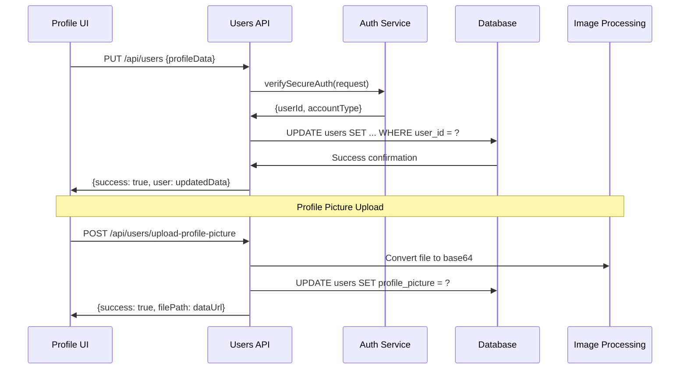

### Database Interactions
- **`users` table**: Core profile data, preferences, contact information
- **`user_addresses` table**: Location data for service delivery
- **Query patterns**: Single-user lookups, profile updates, preference management

---

## 3. Business/Service Provider System

### HTTP Endpoints

| Method | Endpoint | Purpose |
|--------|----------|---------|
| POST | `/api/auth/register` | Business account registration |
| POST | `/api/businesses/upload-documents` | Verification document upload |
| GET | `/api/businesses/applications` | List business applications |
| GET | `/api/businesses/applications/[id]` | Get specific application |
| PUT | `/api/businesses/applications/[id]/approve` | Approve business (admin) |
| PUT | `/api/businesses/applications/[id]/decline` | Decline business (admin) |
| GET | `/api/cremation/profile` | Get business profile |
| PUT | `/api/cremation/profile` | Update business profile |
| GET | `/api/packages` | List service packages |
| POST | `/api/packages` | Create new package |
| GET | `/api/packages/[id]` | Get package details |
| PUT | `/api/packages/[id]` | Update package |
| DELETE | `/api/packages/[id]` | Delete package |
| POST | `/api/packages/[id]/images` | Upload package images |
| GET | `/api/cremation/availability` | Get provider availability |
| POST | `/api/cremation/availability` | Set availability |
| PUT | `/api/cremation/availability/timeslot` | Update time slots |

### File Structure & Responsibilities

#### **Business Registration & Verification**
- **`src/app/api/auth/register/route.ts`**
  - **Business Registration Process**:
    1. Validate business entity type and details
    2. Create user account with 'business' role
    3. Create service_provider profile
    4. Store verification documents
    5. Set application_status to 'pending'
    6. Skip OTP for cremation centers (auto-verify)

- **`src/app/api/businesses/upload-documents/route.ts`**
  - **Process**:
    1. Accept multiple document files
    2. Validate file types (PDF, images)
    3. Store in organized folder structure
    4. Return document URLs for registration

#### **Application Management**
- **`src/app/api/businesses/applications/route.ts`**
  - **GET Process**: List all business applications with status filtering
  - **Admin Controls**: Approval/decline workflow

- **`src/app/api/businesses/applications/[id]/approve/route.ts`**
  - **Process**:
    1. Verify admin authentication
    2. Update service_provider status to 'active'
    3. Update application_status to 'approved'
    4. Send approval notification to business
    5. Log admin action

#### **Service Package Management**
- **`src/app/api/packages/route.ts`**
  - **GET Process**: List packages with provider filtering, category filtering
  - **POST Process**:
    1. Validate business ownership
    2. Create package record with pricing
    3. Handle add-ons and inclusions
    4. Return created package data

- **`src/app/api/packages/[id]/route.ts`**
  - **Individual Package CRUD**: Update pricing, descriptions, availability

- **`src/app/api/packages/[id]/images/route.ts`**
  - **Process**: Upload and manage package gallery images

#### **Availability Management**
- **`src/app/api/cremation/availability/route.ts`**
  - **GET Process**: Return calendar data with available slots
  - **POST Process**: Set business hours and blackout dates

- **`src/app/api/cremation/availability/timeslot/route.ts`**
  - **Process**: Granular time slot management for specific dates

#### **UI Components**
- **`src/components/BusinessAccountModal.tsx`** - Business registration form
- **`src/app/cremation/`** - Complete business dashboard
- **`src/components/packages/`** - Package management interfaces

### End-to-End Business Registration Flow

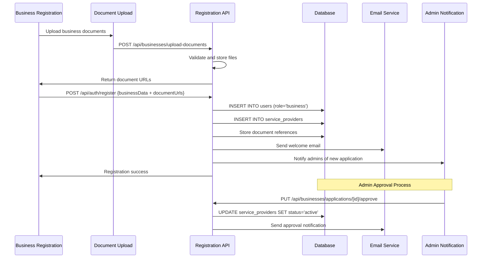

### Database Tables
- **`service_providers`** - Business profiles with verification status
- **`service_packages`** - Service offerings with pricing and inclusions  
- **`provider_availability`** - Calendar-based scheduling data
- **`business_documents`** - Verification document storage
- **`package_images`** - Package gallery associations

---

## 4. Pet Management System

### HTTP Endpoints

| Method | Endpoint | Purpose |
|--------|----------|---------|
| GET | `/api/pets` | List user's pets |
| POST | `/api/pets` | Create new pet profile |
| GET | `/api/pets/[id]` | Get specific pet details |
| PUT | `/api/pets/[id]` | Update pet information |
| DELETE | `/api/pets/[id]` | Delete pet profile |
| POST | `/api/upload/pet-image` | Upload pet photo |

### File Structure & Responsibilities

#### **Pet CRUD Operations**
- **`src/app/api/pets/route.ts`**
  - **GET Process**:
    1. Verify user authentication
    2. Query pets belonging to user: `SELECT * FROM pets WHERE user_id = ?`
    3. Return pet list with photos
  - **POST Process**:
    1. Validate pet data (name, species, breed, weight, etc.)
    2. Insert new pet record
    3. Return created pet with generated ID

- **`src/app/api/pets/[id]/route.ts`**
  - **GET Process**: Individual pet lookup with ownership verification
  - **PUT Process**: Update pet details with validation
  - **DELETE Process**: Soft delete or full removal with booking dependency checks

#### **Pet Image Management**
- **`src/app/api/upload/pet-image/route.ts`**
  - **Process**:
    1. Authenticate user (only fur_parent/user accounts)
    2. Validate file (5MB max, image types only)
    3. Convert to base64 for database storage
    4. Verify pet ownership before update
    5. Update pet record: `UPDATE pets SET photo_path = ? WHERE pet_id = ?`
    6. Return base64 data URL for immediate display

#### **UI Components**
- **`src/app/user/furparent_dashboard/pets/page.tsx`** - Pet management dashboard
- **Pet form components** - Add/edit interfaces with image upload

### End-to-End Pet Creation Flow

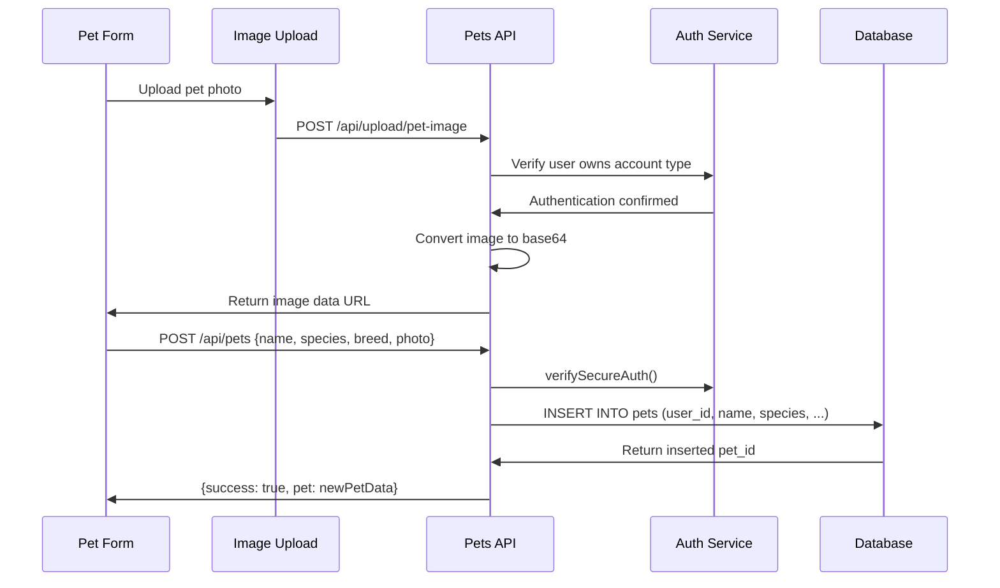

### Database Interactions
- **`pets` table**: Pet profiles with photos, breed, weight, medical information
- **Ownership validation**: All operations verify `pets.user_id = authenticated_user_id`
- **Base64 storage**: Pet photos stored as data URLs in `photo_path` column

---

## 5. Booking & Reservation System

### Current Implementation Status: ✅ FULLY IMPLEMENTED

The booking system includes comprehensive calendar functionality, time slot management, and reservation processing.

### HTTP Endpoints

| Method | Endpoint | Purpose | Status |
|--------|----------|---------|---------|
| GET | `/api/bookings` | List user's bookings | ✅ Active |
| POST | `/api/bookings` | Create new booking | ✅ Active |
| GET | `/api/bookings/[id]` | Get booking details | ✅ Active |
| PUT | `/api/bookings/[id]` | Update booking | ✅ Active |
| POST | `/api/bookings/[id]/cancel` | Cancel booking | ✅ Active |
| POST | `/api/cart-bookings` | Create booking from cart | ✅ Active |
| GET | `/api/cremation/bookings` | List provider's bookings | ✅ Active |
| PUT | `/api/cremation/bookings/[id]` | Update booking status | ✅ Active |
| GET | `/api/cremation/availability` | Get provider availability | ✅ Active |
| POST | `/api/cremation/availability` | Set availability | ✅ Active |
| POST | `/api/cremation/availability/timeslot` | Add/manage time slots | ✅ Active |

### Calendar & Time Selection Features - FULLY FUNCTIONAL

The calendar system includes:
- **Interactive Calendar**: Month/year navigation with availability display
- **Time Slot Management**: Providers can set custom time slots for specific dates
- **Real-Time Availability**: Dynamic calendar updates based on provider schedules
- **Booking Validation**: Prevents double-booking and validates time slot availability
- **Multi-Step Checkout**: Date selection → Time selection → Pet details → Payment
- **Responsive Design**: Mobile-friendly calendar interface

### File Structure & Responsibilities

#### **Core Booking Management**
- **`src/app/api/bookings/route.ts`**
  - **GET Process**:
    1. Authenticate user
    2. Query bookings: `SELECT * FROM service_bookings WHERE user_id = ?`
    3. Join with packages, providers, pets for complete data
    4. Return booking list with status and payment info
  
  - **POST Process**:
    1. Validate required fields (date, time, petName, petType)
    2. Calculate total amount including delivery fees
    3. Create booking record with 'pending' status
    4. Initialize payment transaction record
    5. Send booking confirmation notifications

- **`src/app/api/bookings/[id]/route.ts`**
  - **Individual booking operations** with ownership verification

#### **Cart Integration**
- **`src/app/api/cart-bookings/route.ts`**
  - **Process**:
    1. Verify fur_parent authentication
    2. Extract cart item data (packageId, providerId, petId, addOns)
    3. Calculate processing dates based on package requirements
    4. Use database transactions for data integrity:
       ```sql
       BEGIN TRANSACTION;
       INSERT INTO bookings (...) VALUES (...);
       INSERT INTO payment_transactions (...) VALUES (...);
       COMMIT;
       ```

#### **Business Booking Management**
- **`src/app/api/cremation/bookings/route.ts`**
  - **Provider View**: List bookings for specific cremation business
  - **Status Updates**: Update booking progress (confirmed, in_progress, completed)

#### **Booking Cancellation**
- **`src/app/api/bookings/[id]/cancel/route.ts`**
- **`src/services/bookingCancellationService.ts`**
  - **Process**:
    1. Verify booking ownership and cancellation eligibility
    2. Update booking status to 'cancelled'
    3. Process automatic refund if payment exists
    4. Send cancellation notifications to all parties
    5. Update provider availability if applicable

#### **Shopping Cart State**
- **`src/contexts/CartContext.tsx`**
  - **React Context**: Manages cart items, quantities, add-ons
  - **Local Storage**: Persist cart across sessions
  - **Functions**: `addItem()`, `removeItem()`, `updateQuantity()`, `clearCart()`

#### **UI Components - Calendar & Booking Interface**
- **`src/components/booking/TimeSlotSelector.tsx`** - Interactive calendar with time slot selection
- **`src/components/booking/AvailabilityCalendar.tsx`** - Provider availability management calendar
- **`src/components/booking/CalendarHeader.tsx`** - Calendar navigation header
- **`src/components/booking/MonthGrid.tsx`** - Monthly calendar grid display
- **`src/components/booking/TimeSlotModal.tsx`** - Time slot creation/editing modal
- **`src/app/user/furparent_dashboard/bookings/checkout/page.tsx`** - Complete checkout flow with date/time selection
- **`src/components/cart/`** - Shopping cart management

#### **Calendar Functionality Details**
- **Date Selection**: Users can select available dates from calendar
- **Time Slot Selection**: Choose specific time slots set by providers
- **Conflict Prevention**: System prevents overlapping bookings
- **Availability Validation**: Real-time checking of provider availability
- **Processing Time Calculation**: Automatic date calculation based on package processing requirements

### End-to-End Booking Flow

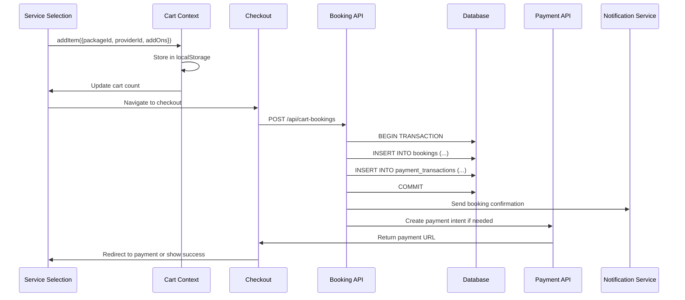

### Database Tables
- **`service_bookings`** - Main booking records with status tracking
- **`booking_addons`** - Additional services selected
- **`payment_transactions`** - Associated payment records
- **Complex queries**: Multi-table joins for complete booking views

---

## 6. Payment Processing System

### HTTP Endpoints

| Method | Endpoint | Purpose |
|--------|----------|---------|
| POST | `/api/payments/create-intent` | Create PayMongo payment intent |
| GET | `/api/payments/status` | Check payment status |
| POST | `/api/payments/webhook` | PayMongo webhook handler |
| POST | `/api/payments/cleanup` | Clean expired payments |
| POST | `/api/payments/offline/confirm` | Manual payment confirmation |
| GET | `/api/payments/offline/receipt` | Upload payment receipt |

### File Structure & Responsibilities

#### **Payment Intent Creation**
- **`src/app/api/payments/create-intent/route.ts`**
  - **Process**:
    1. Authenticate user and validate booking ownership
    2. Extract payment details (amount, currency, method)
    3. Create PayMongo payment intent:
       ```javascript
       const paymentIntent = await createPayMongoPaymentIntent({
         amount: amount * 100, // Convert to cents
         currency: 'PHP',
         payment_method_types: ['gcash', 'card']
       });
       ```
    4. Store payment transaction record
    5. Return checkout URL for payment completion

#### **Webhook Processing**
- **`src/app/api/payments/webhook/route.ts`**
  - **Security**: Validates PayMongo webhook signatures
  - **Event Handling**:
    - `payment.paid` → Update transaction status, confirm booking
    - `payment.failed` → Mark transaction as failed, notify user
    - `source.chargeable` → Process GCash payments
    - `refund.succeeded` → Update refund records

#### **Payment Service Layer**
- **`src/services/paymentService.ts`**
  - **Core Functions**:
    - `createPayment()` - PayMongo integration wrapper
    - `updatePaymentStatus()` - Transaction status updates
    - `processPaymentWebhook()` - Webhook processing logic
    - `getPaymentStatus()` - Status queries for UI

#### **PayMongo Integration**
- **`src/lib/paymongo.ts`**
  - **API Wrapper Functions**:
    - `createPayMongoPaymentIntent()` - Payment intent creation
    - `retrievePayMongoPayment()` - Payment status lookup
    - `createPayMongoRefund()` - Refund processing
    - `validateWebhookSignature()` - Security verification

#### **Offline Payment Handling**
- **`src/app/api/payments/offline/confirm/route.ts`**
  - **Process**:
    1. Accept manual payment confirmation with receipt
    2. Create offline payment record
    3. Update booking payment status
    4. Send confirmation notifications

### End-to-End Payment Flow

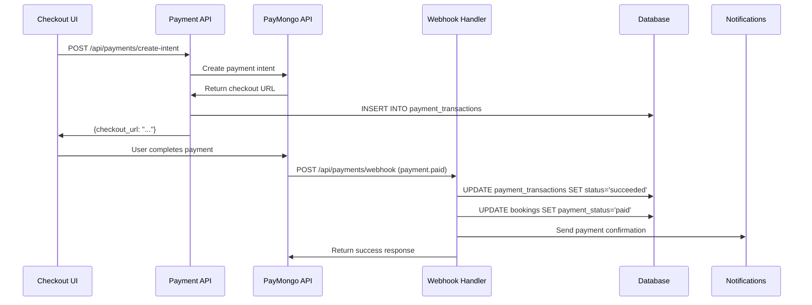

### Payment Methods Support
- **GCash**: Via PayMongo Sources API
- **Credit/Debit Cards**: Via PayMongo Payment Intents API
- **Offline Payments**: Manual confirmation with receipt upload

### Database Tables
- **`payment_transactions`** - Payment records with provider transaction IDs
- **`offline_payment_receipts`** - Manual payment confirmations
- **Transaction integrity**: Uses database transactions for payment-booking consistency

---

## 7. Refund Management System

### HTTP Endpoints

| Method | Endpoint | Purpose |
|--------|----------|---------|
| GET | `/api/refunds` | List user's refund requests |
| POST | `/api/refunds` | Request refund |
| GET | `/api/refunds/[id]` | Get refund details |
| PUT | `/api/refunds/[id]` | Update refund status |
| POST | `/api/cremation/refunds/[id]/approve` | Approve refund (business) |
| POST | `/api/cremation/refunds/[id]/deny` | Deny refund (business) |
| GET | `/api/admin/refunds` | Admin refund oversight |
| POST | `/api/admin/refunds/[id]/retry` | Retry failed refund |

### File Structure & Responsibilities

#### **Refund Request Management**
- **`src/app/api/refunds/route.ts`**
  - **GET Process**: List user's refund requests with status filtering
  - **POST Process**:
    1. Validate booking ownership and refund eligibility
    2. Check if booking is cancellable/refundable
    3. Create refund record with 'pending' status
    4. Send notification to cremation business
    5. Return refund request confirmation

#### **Business Refund Processing**
- **`src/app/api/cremation/refunds/[id]/approve/route.ts`**
  - **Process**:
    1. Verify business owns the booking
    2. Process refund via PayMongo API
    3. Update refund status to 'approved' and then 'completed'
    4. Send confirmation notifications to user
    5. Log refund transaction details

#### **Refund Service Layer**
- **`src/services/refundService.ts`**
  - **Core Functions**:
    - `processRefund()` - PayMongo refund API integration
    - `calculateRefundAmount()` - Amount calculation with fees
    - `reconcileQueuedAutomaticRefund()` - Handle delayed refund processing
    - `getRefundStatus()` - Status tracking queries

#### **Notification Integration**
- **`src/utils/refundNotificationService.ts`**
  - **Process**: Send status updates to all parties involved
  - **Templates**: Different messages for users, businesses, admins

### End-to-End Refund Flow

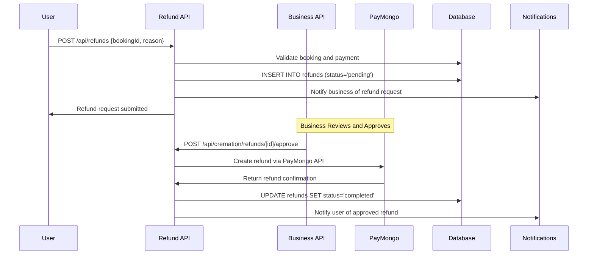

### Database Tables
- **`refunds`** - Refund requests with status and amount tracking
- **`refund_history`** - Status change audit trail
- **PayMongo integration**: Links with payment transaction IDs for processing

---

## 8. Notification System

### HTTP Endpoints

| Method | Endpoint | Purpose |
|--------|----------|---------|
| GET | `/api/notifications` | List user notifications |
| POST | `/api/notifications/mark-read` | Mark notifications as read |
| GET | `/api/notifications/sse` | Server-Sent Events stream |
| POST | `/api/notifications/process-reminders` | Process scheduled notifications |
| GET | `/api/notifications/system` | System-wide announcements |

### File Structure & Responsibilities

#### **Real-Time Notification Streaming**
- **`src/app/api/notifications/sse/route.ts`**
  - **Purpose**: Server-Sent Events endpoint for real-time notifications
  - **Process**:
    1. Verify authentication and create connection ID
    2. Create ReadableStream with controller
    3. Store active connections in Map for broadcasting
    4. Send keep-alive pings every 30 seconds
    5. Handle connection cleanup on abort
  - **Broadcasting**: `broadcastToUser(userId, accountType, notificationData)`

#### **Notification Context & State Management**
- **`src/context/NotificationContext.tsx`**
  - **React Context**: Manages notification state across components
  - **SSE Connection**: Automatic reconnection with exponential backoff
  - **Fallback Polling**: If SSE fails, falls back to periodic API calls
  - **Functions**: `markAsRead()`, `markAllAsRead()`, `removeNotification()`

#### **Notification Service Layer**
- **`src/utils/notificationService.ts`** - General user notifications
- **`src/utils/businessNotificationService.ts`** - Business-specific notifications
- **`src/utils/adminNotificationService.ts`** - Admin notifications
- **`src/utils/comprehensiveNotificationService.ts`** - Unified notification creation

#### **Email Integration**
- **`src/lib/consolidatedEmailService.ts`**
  - **Queue System**: Reliable email delivery with retry logic
  - **Templates**: Dynamic email template generation
  - **Process**:
    1. Queue email with priority and scheduling
    2. Process queue with retry logic for failed sends
    3. Log delivery status and failures

#### **SMS Integration**
- **`src/lib/httpSmsService.ts`**
  - **Twilio Integration**: SMS notifications for critical updates
  - **Selective Sending**: Based on user notification preferences

### End-to-End Real-Time Notification Flow

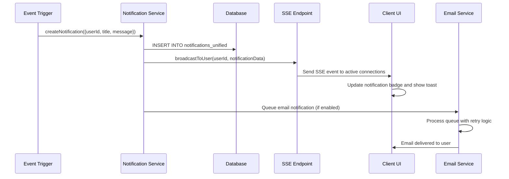

### Notification Categories
- **Booking**: Creation, updates, cancellations, confirmations
- **Payment**: Success, failures, refund processing
- **System**: Maintenance, policy updates, announcements  
- **Admin**: User actions, business applications, system alerts

### Database Tables
- **`notifications_unified`** - Central notification storage with JSON data
- **`email_queue`** - Email delivery queue with retry logic
- **`email_logs`** - Delivery status and error tracking

---

## 9. Admin Management System

### HTTP Endpoints

| Method | Endpoint | Purpose |
|--------|----------|---------|
| GET | `/api/admin/dashboard` | Admin dashboard data |
| GET | `/api/admin/dashboard-stats` | Analytics and metrics |
| GET | `/api/admin/users` | List all users |
| PUT | `/api/admin/users/[id]` | Update user details |
| POST | `/api/admin/users/restrict` | Restrict user account |
| POST | `/api/admin/users/unrestrict` | Remove user restrictions |
| GET | `/api/admin/cremation-businesses` | List all businesses |
| PUT | `/api/admin/cremation-businesses/[id]` | Update business status |
| POST | `/api/admin/cremation-businesses/restrict` | Restrict business |
| GET | `/api/admin/bookings` | View all bookings |
| GET | `/api/admin/payments` | Payment analytics |
| GET | `/api/admin/reviews` | Review management |
| GET | `/api/admin/logs` | Admin activity logs |
| POST | `/api/admin/create` | Create new admin account |

### File Structure & Responsibilities

#### **Dashboard & Analytics**
- **`src/app/api/admin/dashboard/route.ts`**
  - **Process**:
    1. Verify admin authentication
    2. Execute multiple database queries for metrics:
       - Total users, businesses, bookings
       - Revenue analytics and payment statistics
       - Recent activity summaries
    3. Return comprehensive dashboard data

- **`src/app/api/admin/dashboard-stats/route.ts`**
  - **Advanced Analytics**: Detailed metrics with date filtering

#### **User Management**
- **`src/app/api/admin/users/route.ts`**
  - **GET Process**: Paginated user listing with search and filtering
  - **PUT Process**: Bulk user operations and status updates

- **`src/app/api/admin/users/restrict/route.ts`**
  - **Process**:
    1. Validate restriction reason and duration
    2. Update user status to 'restricted'
    3. Create restriction record in unified restrictions table
    4. Send restriction notification to user
    5. Log admin action with reason

#### **Business Management**
- **`src/app/api/admin/cremation-businesses/route.ts`**
  - **Process**: List businesses with application status, verification details
  - **Filtering**: By status, application date, verification level

- **`src/app/api/admin/cremation-businesses/restrict/route.ts`**
  - **Business Restriction**: Similar to user restrictions but for service providers

#### **System Oversight**
- **`src/app/api/admin/logs/route.ts`**
  - **Audit Trail**: Comprehensive logging of all admin actions
  - **Query Process**: Searchable logs with user, action, and timestamp filters

#### **Admin Utilities**
- **`src/utils/adminUtils.ts`**
  - **Helper Functions**: Common admin operations and validations
- **`src/utils/adminNotificationService.ts`**
  - **Admin Notifications**: System alerts and admin-to-admin communications

#### **UI Components**
- **`src/app/admin/`** - Complete admin dashboard
- **`src/components/navigation/AdminSidebar.tsx`** - Admin navigation
- **`src/components/admin/`** - Admin-specific UI components

### End-to-End User Restriction Flow

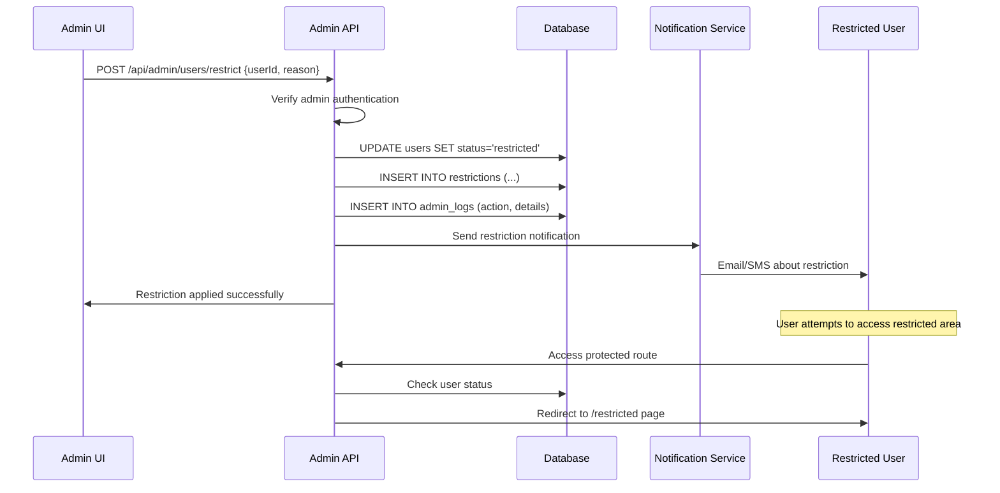

### Database Tables
- **`users`** - User accounts with admin status flags
- **`service_providers`** - Business accounts with verification status
- **`restrictions`** - Unified restriction tracking for users and businesses
- **`admin_logs`** - Comprehensive audit trail of admin actions
- **`admin_notifications`** - Admin-specific notification system

---

## 10. File Upload & Image Management

### HTTP Endpoints

| Method | Endpoint | Purpose |
|--------|----------|---------|
| POST | `/api/upload/pet-image` | Upload pet photos |
| POST | `/api/upload/package-image` | Upload service package images |
| POST | `/api/users/upload-profile-picture` | Upload user avatars |
| POST | `/api/cremation/upload-profile-picture` | Upload business avatars |
| POST | `/api/admin/upload-profile-picture` | Upload admin avatars |
| GET | `/api/image/[...path]` | Serve uploaded images |
| POST | `/api/businesses/upload-documents` | Upload business verification documents |

### File Structure & Responsibilities

#### **Image Upload Processing**
- **`src/app/api/upload/pet-image/route.ts`**
  - **Process**:
    1. Verify user authentication (fur_parent/user only)
    2. Validate file size (5MB max) and type (images only)
    3. Convert file to base64 for database storage
    4. If petId provided, update pet record directly
    5. Return base64 data URL for immediate display

- **`src/app/api/upload/package-image/route.ts`**
  - **Process**:
    1. Verify business ownership of package
    2. Validate image files
    3. Store in organized directory structure: `/uploads/packages/{packageId}/`
    4. Update package images association
    5. Return file paths for gallery management

#### **Profile Picture Management**
- **`src/app/api/users/upload-profile-picture/route.ts`**
- **`src/app/api/cremation/upload-profile-picture/route.ts`**
- **`src/app/api/admin/upload-profile-picture/route.ts`**
  - **Unified Process**:
    1. Authentication verification per account type
    2. File validation and size checking
    3. Base64 conversion for database storage
    4. Update respective profile picture field
    5. Return data URL for immediate UI update

#### **Image Serving**
- **`src/app/api/image/[...path]/route.ts`**
  - **Purpose**: Serve uploaded images with proper headers
  - **Security**: Path validation to prevent directory traversal
  - **Process**: Read file from filesystem and return with appropriate MIME type

#### **Document Upload (Business Verification)**
- **`src/app/api/businesses/upload-documents/route.ts`**
  - **Process**:
    1. Accept multiple document files (PDF, images)
    2. Validate file types and sizes
    3. Store in organized structure: `/uploads/documents/{businessId}/`
    4. Return document URLs for registration process

#### **Middleware Integration**
- **`src/middleware.ts`**
  - **Image Rewriting**: Redirects `/uploads/*` to `/api/image/*` for consistent serving
  - **Benefits**: Environment compatibility, access control, proper headers

#### **Utility Functions**
- **`src/utils/uploadHandler.ts`** - Common upload processing functions
- **`src/utils/imageUtils.ts`** - Image manipulation and validation
- **`src/utils/profileImageUtils.ts`** - Profile-specific image handling

#### **UI Components**
- **`src/components/profile/ProfilePictureUpload.tsx`** - Reusable image upload component

### End-to-End Image Upload Flow

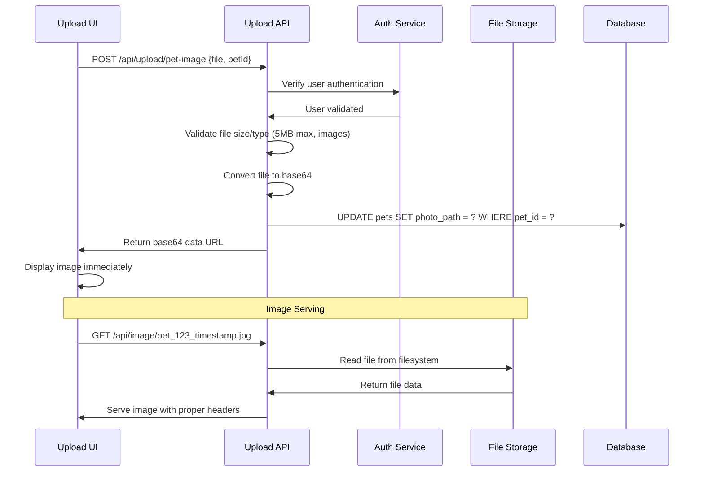

### Storage Strategy
- **Database Storage**: Small images (profiles, pets) stored as base64 data URLs
- **File System Storage**: Larger files (documents, package galleries) stored in organized directories
- **Path Structure**: `/uploads/{type}/{id}/{filename}` for organization and security

---

## 11. Review & Appeals System

### HTTP Endpoints

| Method | Endpoint | Purpose |
|--------|----------|---------|
| GET | `/api/reviews` | List reviews |
| POST | `/api/reviews` | Create review |
| GET | `/api/reviews/provider/[id]` | Get provider reviews |
| GET | `/api/reviews/user/[id]` | Get user reviews |
| GET | `/api/reviews/pending` | Get reviewable bookings |
| GET | `/api/appeals` | List user appeals |
| POST | `/api/appeals` | Submit new appeal |
| GET | `/api/appeals/[id]` | Get appeal details |
| PUT | `/api/appeals/[id]` | Update appeal status (admin) |
| GET | `/api/appeals/[id]/history` | Appeal history |

### File Structure & Responsibilities

#### **Review System**
- **`src/app/api/reviews/route.ts`**
  - **GET Process**: List reviews with filtering by provider, user, rating
  - **POST Process**:
    1. Validate user completed the booking
    2. Check review hasn't already been submitted
    3. Validate rating (1-5) and comment length
    4. Create review record with expiration date
    5. Update provider rating aggregates

- **`src/app/api/reviews/pending/route.ts`**
  - **Process**: Find completed bookings eligible for review
  - **Query**: Bookings with status='completed' and no existing review

#### **Appeals System**  
- **`src/app/api/appeals/route.ts`**
  - **POST Process**:
    1. Verify user authentication
    2. Check for existing pending appeals
    3. Validate appeal data (subject ≤255 chars, message ≤5000 chars)
    4. Determine user type (personal vs business)
    5. Create appeal record with 'pending' status
    6. Notify admins of new appeal

- **`src/app/api/appeals/[id]/route.ts`**
  - **PUT Process (Admin Only)**:
    1. Validate admin authentication
    2. Update appeal status (pending → under_review → approved/rejected)
    3. Record status change in appeal_history
    4. Send status notification to appealing user
    5. Log admin action and response

#### **Appeals History Tracking**
- **`src/app/api/appeals/[id]/history/route.ts`**
  - **Process**: Detailed audit trail of appeal status changes with admin responses

#### **Restrictions Integration**
- Appeals system integrates with the unified restrictions table
- Users can appeal restrictions placed on their accounts
- Admins can approve appeals to lift restrictions

#### **UI Components**
- **`src/app/appeals/page.tsx`** - User appeals interface
- **`src/components/reviews/`** - Review display and submission components

### End-to-End Appeal Submission Flow

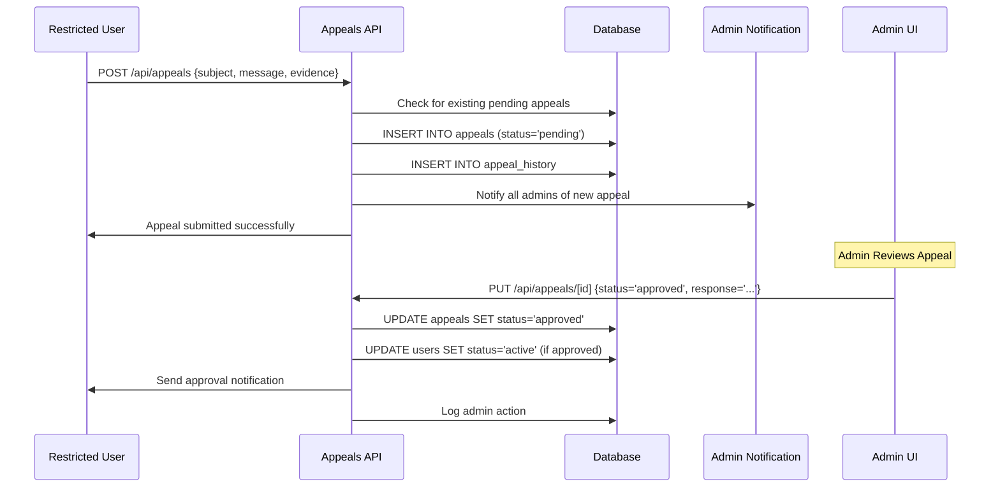

### Database Tables
- **`appeals`** - Appeal requests with user details and status
- **`appeal_history`** - Status change tracking with admin responses
- **`reviews`** - User reviews with ratings and expiration dates
- **Integration**: Appeals reference the unified restrictions system

---

## 12. Shared Utilities & Infrastructure

### Database Layer

#### **Core Database Files**
- **`src/lib/db/index.ts`** - Main database exports and configuration
- **`src/lib/db/query.ts`** - Primary query function with connection pooling
- **`src/lib/db/pool.ts`** - MySQL connection pool management
- **`src/lib/db/transaction.ts`** - Transaction wrapper for data integrity
- **`src/lib/db/health.ts`** - Database health checking
- **`src/lib/db/schema.ts`** - Table existence validation

#### **Database Usage Pattern**
```javascript
// Standard query
const users = await query('SELECT * FROM users WHERE role = ?', ['admin']);

// Transaction example
const result = await withTransaction(async (transaction) => {
  const booking = await transaction.query('INSERT INTO bookings (...) VALUES (...)', []);
  const payment = await transaction.query('INSERT INTO payment_transactions (...) VALUES (...)', []);
  return { booking, payment };
});
```

### Authentication Infrastructure

#### **Core Auth Files**
- **`src/lib/secureAuth.ts`** - API route authentication
- **`src/utils/auth.ts`** - Token parsing utilities  
- **`src/lib/jwt.ts`** - JWT generation and validation
- **`src/utils/rateLimitUtils.ts`** - API abuse prevention

#### **Usage in API Routes**
```javascript
export async function GET(request: NextRequest) {
  const user = await verifySecureAuth(request);
  if (!user) {
    return NextResponse.json({ error: 'Unauthorized' }, { status: 401 });
  }
  // Continue with authenticated user
}
```

### External Service Integrations

#### **PayMongo Integration**
- **`src/lib/paymongo.ts`** - Complete PayMongo API wrapper
- **Functions**: Payment intents, sources, refunds, webhook validation

#### **Email System**
- **`src/lib/consolidatedEmailService.ts`** - Email queue and delivery
- **`src/lib/emailTemplates.ts`** - Dynamic email template generation
- **Queue Processing**: Retry logic, delivery tracking, error handling

#### **SMS Integration**
- **`src/lib/httpSmsService.ts`** - Twilio SMS integration
- **Usage**: Critical notifications, OTP delivery, urgent alerts

### Utility Libraries

#### **Application Utilities**
- **`src/utils/appUrl.ts`** - Dynamic URL generation with port detection
- **`src/utils/cache.ts`** - Client-side caching for geocoding/routing
- **`src/utils/distance.ts`** - Geographic distance calculations
- **`src/utils/geocoding.ts`** - Address to coordinates conversion
- **`src/utils/routing.ts`** - Navigation utilities

#### **Business Logic Helpers**
- **`src/lib/revenueCalculator.ts`** - Revenue and commission calculations
- **`src/utils/passwordValidation.ts`** - Password strength validation
- **`src/utils/numberUtils.ts`** - Formatting and calculation helpers

### Context Providers

#### **Global State Management**
- **`src/contexts/AuthStateContext.tsx`** - Authentication state
- **`src/contexts/CartContext.tsx`** - Shopping cart management
- **`src/contexts/LoadingContext.tsx`** - Loading state management
- **`src/context/NotificationContext.tsx`** - Real-time notifications
- **`src/context/ToastContext.tsx`** - User feedback messages

### Type Definitions

#### **TypeScript Interfaces**
- **`src/types/database.d.ts`** - Database result types
- **`src/types/payment.ts`** - Payment-related interfaces
- **`src/types/serviceProvider.d.ts`** - Business entity types
- **`src/types/packages.ts`** - Service package definitions

### Configuration Files

#### **Framework Configuration**
- **`next.config.js`** - Next.js application configuration
- **`tailwind.config.js`** - Tailwind CSS customization
- **`tsconfig.json`** - TypeScript compiler options
- **`package.json`** - Dependencies and scripts

---

## 13. System Administration & Monitoring

### HTTP Endpoints

| Method | Endpoint | Purpose | Status |
|--------|----------|---------|---------|
| GET | `/api/version` | Application version and deployment info | ✅ Active |
| GET | `/api/db-health` | Database connectivity and schema validation | ✅ Active |
| GET | `/api/sms/debug` | SMS service configuration status | ✅ Active |
| GET | `/api/sms/diagnose` | Comprehensive SMS diagnostics | ✅ Active |
| POST | `/api/email/queue/process` | Manual email queue processing | ✅ Active |

### File Structure & Responsibilities

#### **System Health Monitoring**
- **`src/app/api/version/route.ts`**
  - **Purpose**: Returns application version, build info, and environment details
  - **Data**: Package version, deployment timestamp, environment type
  - **Usage**: System status verification and deployment tracking

- **`src/app/api/db-health/route.ts`**
  - **Purpose**: Comprehensive database health checking
  - **Process**:
    1. Test database connectivity
    2. Validate required table existence
    3. Check table structure integrity
    4. Verify environment configuration
    5. Return detailed health report

#### **SMS Service Management**
- **`src/app/api/sms/debug/route.ts`**
  - **Purpose**: SMS service configuration and status checking
  - **Features**: Environment validation, phone formatting tests, service status
  
- **`src/app/api/sms/diagnose/route.ts`**
  - **Purpose**: Comprehensive SMS system diagnostics
  - **Process**:
    1. Environment variable validation
    2. Service connectivity testing
    3. Phone number formatting verification
    4. Test message sending capability
    5. Network connectivity assessment

#### **Email Queue Management**
- **`src/app/api/email/queue/process/route.ts`**
  - **Purpose**: Manual processing of queued emails
  - **Usage**: Background job processing, retry failed emails
  - **Integration**: Works with consolidatedEmailService queue system

---

## 14. Advanced File Storage & Geocoding

### HTTP Endpoints

| Method | Endpoint | Purpose | Status |
|--------|----------|---------|---------|
| GET | `/api/blob/upload-url` | Generate Vercel Blob upload URLs | ✅ Active |
| GET | `/api/geocoding` | Multi-provider address geocoding | ✅ Active |

### File Structure & Responsibilities

#### **Cloud Storage Integration**
- **`src/app/api/blob/upload-url/route.ts`**
  - **Purpose**: Alternative to database storage for large files
  - **Process**:
    1. Generate secure Vercel Blob upload URL
    2. Configure public access permissions
    3. Return upload endpoint for client-side uploads
  - **Benefits**: Reduces database load, handles large files efficiently

#### **Enhanced Geocoding System**
- **`src/app/api/geocoding/route.ts`**
  - **Purpose**: Multi-provider geocoding optimized for Philippines
  - **Providers**: Photon, Pelias, Nominatim with fallback hierarchy
  - **Features**:
    - Philippines-specific address enhancement
    - Confidence scoring and provider selection
    - Forward geocoding (address → coordinates)
    - Reverse geocoding (coordinates → address)
    - Fallback coordinates for common Philippine locations
  - **Process**:
    1. Enhance address with Philippine context
    2. Try providers in priority order
    3. Apply confidence scoring
    4. Return best results with provider attribution

---

## 15. Business Analytics & Reporting

### HTTP Endpoints

| Method | Endpoint | Purpose | Status |
|--------|----------|---------|---------|
| GET | `/api/cremation/reports` | Business performance analytics | ✅ Active |
| GET/POST | `/api/cremation/payment-qr` | Payment QR code management | ✅ Active |

### File Structure & Responsibilities

#### **Business Intelligence System**
- **`src/app/api/cremation/reports/route.ts`**
  - **Purpose**: Comprehensive business analytics for cremation providers
  - **Process**:
    1. Authenticate business account
    2. Apply date range filtering (7 days, 30 days, 90 days, etc.)
    3. Calculate booking statistics and revenue metrics
    4. Analyze refund data and rates
    5. Generate top services performance
    6. Return comprehensive analytics dashboard data

- **`src/app/cremation/reports/page.tsx`**
  - **UI Features**:
    - Interactive date range filtering
    - Revenue and booking analytics cards
    - Refund tracking and analysis
    - Top services performance charts
    - Export functionality for reports
    - Real-time data refresh capability

#### **Payment QR Management**
- **`src/app/api/cremation/payment-qr/route.ts`**
  - **GET Process**: Retrieve current QR code for provider
  - **POST Process**: Upload new payment QR code
    1. Validate image file (JPEG, PNG, WebP, max 10MB)
    2. Convert to base64 for database storage
    3. Store in service_providers table
    4. Return QR code data for immediate display

- **QR Integration in Settings**
  - **Component**: Payment QR section in `/cremation/settings`
  - **Features**: Drag-and-drop upload, progress tracking, validation

---

## 16. Enhanced Settings & Configuration

### HTTP Endpoints

| Method | Endpoint | Purpose | Status |
|--------|----------|---------|---------|
| GET/PUT | `/api/cremation/notification-preferences` | Business notification settings | ✅ Active |

### File Structure & Responsibilities

#### **Business Settings Management**
- **`src/app/cremation/settings/page.tsx`**
  - **Purpose**: Comprehensive settings interface for cremation businesses
  - **Features**:
    - SMS/Email notification preferences with toggles
    - Payment QR code upload with drag-and-drop interface
    - Real-time file upload progress tracking
    - Form validation and error handling
    - Skeleton loading states for better UX

#### **Notification Preferences**
- **`src/app/api/cremation/notification-preferences/route.ts`**
  - **GET Process**: Retrieve current notification settings
  - **PUT Process**: Update SMS/email notification preferences
  - **Settings**: SMS notifications, email notifications for bookings and business updates

### End-to-End Settings Flow

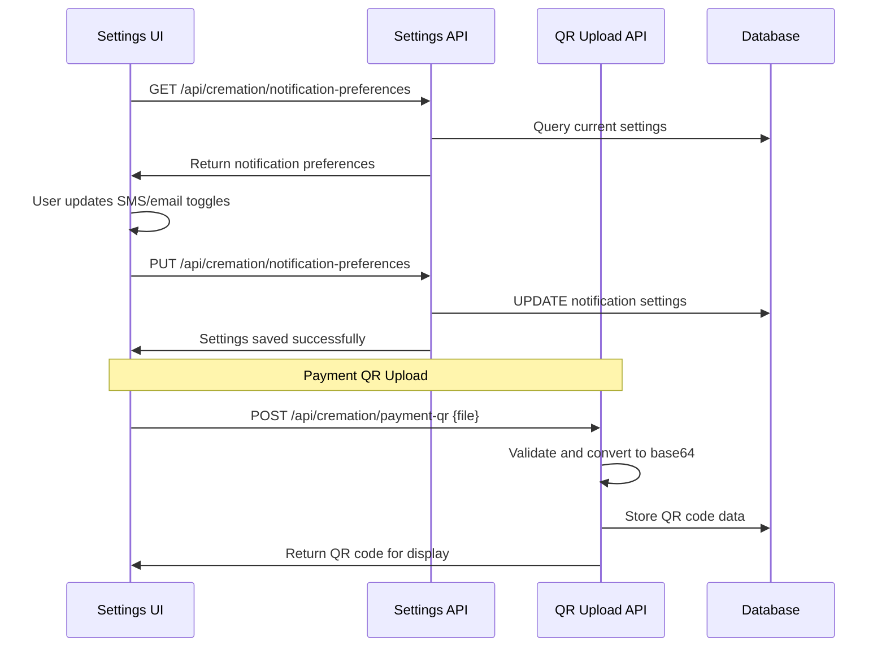

---

## System Status & Known Issues

### 🔍 Implementation Status Overview

Based on codebase analysis as of September 2025:

#### ✅ **FULLY FUNCTIONAL SYSTEMS**
1. **Authentication & Registration**
   - Complete multi-modal registration flow
   - Personal and business account types
   - Document upload for business verification
   - OTP email verification
   - Password reset functionality

2. **Calendar & Booking System**
   - Interactive calendar components
   - Time slot management for providers
   - Real-time availability checking
   - Booking validation and conflict prevention
   - Complete checkout flow with date/time selection

3. **Payment Processing**
   - PayMongo integration with GCash and cards
   - Webhook handling for payment status
   - Offline payment support
   - Payment QR code management for businesses

4. **Notification System**
   - Real-time SSE notifications
   - Email notifications with queue system
   - SMS integration via Twilio

5. **Business Intelligence & Reporting**
   - Comprehensive analytics dashboard
   - Revenue and booking metrics
   - Refund tracking and analysis  
   - Export functionality
   - Date range filtering

6. **System Administration**
   - Database health monitoring
   - Application version tracking
   - SMS service diagnostics
   - Email queue management

7. **Advanced File Storage**
   - Vercel Blob integration for large files
   - Enhanced geocoding with multiple providers
   - Philippines-specific address optimization

8. **Business Configuration**
   - Notification preferences management
   - Payment QR upload system
   - Settings with real-time updates

#### ⚠️ **POTENTIAL ISSUES TO INVESTIGATE**

If you're experiencing issues with registration or calendar functionality, check:

1. **Registration Issues**:
   - Check browser console for JavaScript errors
   - Verify modal state management in `src/app/page.tsx`
   - Ensure database connection is working
   - Check email service configuration for OTP delivery

2. **Calendar Issues**:
   - Verify provider availability data in database
   - Check TimeSlotSelector component state management
   - Ensure proper date formatting in API responses
   - Test time slot creation/selection flow

3. **Common Troubleshooting**:
   - Clear browser cache and localStorage
   - Check network connectivity to API endpoints
   - Verify environment variables are set correctly
   - Review browser developer tools for errors

---

## Architecture Summary

### Request Flow Pattern
1. **Client Request** → **Middleware** (auth check) → **API Route** (business logic) → **Database** → **Response**
2. **Real-time Updates** → **SSE Connection** → **Notification Broadcasting** → **UI State Update**
3. **External Webhooks** → **Signature Validation** → **Event Processing** → **Database Update** → **User Notification**

### Data Storage Strategy
- **MySQL Database** - Primary data storage with connection pooling
- **Base64 Database Storage** - Small images (profiles, pet photos)  
- **File System Storage** - Large files (documents, package galleries)
- **Local Storage** - Client-side cart and preference caching

### Security Implementation
- **JWT Authentication** - HTTP-only cookies for security
- **Role-Based Access Control** - Middleware-enforced route protection
- **API Rate Limiting** - Database-backed abuse prevention
- **Webhook Signature Validation** - PayMongo security verification
- **Input Validation** - Consistent parameter validation across endpoints

### Real-Time Features
- **Server-Sent Events** - Real-time notifications with fallback polling
- **Automatic Reconnection** - Exponential backoff for connection resilience
- **Multi-User Broadcasting** - Targeted notifications by user type and ID
