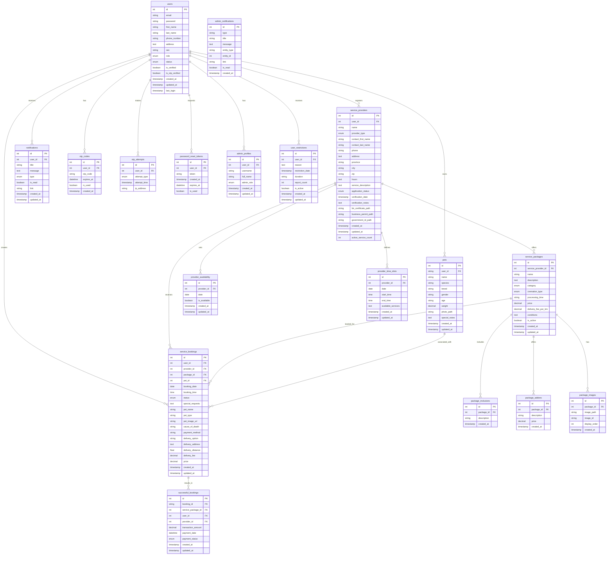

```mermaid
erDiagram
    users ||--o{ pets : owns
    users ||--o{ service_providers : registers
    users ||--o{ service_bookings : creates
    users ||--o{ notifications : receives
    users ||--o{ otp_codes : has
    users ||--o{ otp_attempts : makes
    users ||--o{ password_reset_tokens : requests
    users ||--o{ admin_profiles : has
    users ||--o{ user_restrictions : receives

    service_providers ||--o{ service_packages : offers
    service_providers ||--o{ provider_availability : sets
    service_providers ||--o{ provider_time_slots : defines
    service_providers ||--o{ service_bookings : receives

    service_packages ||--o{ package_inclusions : includes
    service_packages ||--o{ package_addons : offers
    service_packages ||--o{ package_images : has
    service_packages ||--o{ service_bookings : booked_for

    pets ||--o{ service_bookings : associated_with

    service_bookings ||--o{ successful_bookings : results_in

    users {
        int id PK
        string email
        string password
        string first_name
        string last_name
        string phone_number
        text address
        string sex
        enum role
        enum status
        boolean is_verified
        boolean is_otp_verified
        timestamp created_at
        timestamp updated_at
        timestamp last_login
    }

    pets {
        int id PK
        string user_id FK
        string name
        string species
        string breed
        string gender
        string age
        decimal weight
        string photo_path
        text special_notes
        timestamp created_at
        timestamp updated_at
    }

    service_providers {
        int id PK
        int user_id FK
        string name
        enum provider_type
        string contact_first_name
        string contact_last_name
        string phone
        text address
        string province
        string city
        string zip
        text hours
        text service_description
        enum application_status
        timestamp verification_date
        text verification_notes
        string bir_certificate_path
        string business_permit_path
        string government_id_path
        timestamp created_at
        timestamp updated_at
        int active_service_count
    }

    service_packages {
        int id PK
        int service_provider_id FK
        string name
        text description
        enum category
        enum cremation_type
        string processing_time
        decimal price
        decimal delivery_fee_per_km
        text conditions
        boolean is_active
        timestamp created_at
        timestamp updated_at
    }

    package_inclusions {
        int id PK
        int package_id FK
        string description
        timestamp created_at
    }

    package_addons {
        int id PK
        int package_id FK
        string description
        decimal price
        timestamp created_at
    }

    package_images {
        int id PK
        int package_id FK
        string image_path
        string image_id
        int display_order
        timestamp created_at
    }

    provider_availability {
        int id PK
        int provider_id FK
        date date
        boolean is_available
        timestamp created_at
        timestamp updated_at
    }

    provider_time_slots {
        int id PK
        int provider_id FK
        date date
        time start_time
        time end_time
        text available_services
        timestamp created_at
        timestamp updated_at
    }

    service_bookings {
        int id PK
        int user_id FK
        int provider_id FK
        int package_id FK
        int pet_id FK
        date booking_date
        time booking_time
        enum status
        text special_requests
        string pet_name
        string pet_type
        string pet_image_url
        string cause_of_death
        string payment_method
        string delivery_option
        text delivery_address
        float delivery_distance
        decimal delivery_fee
        decimal price
        timestamp created_at
        timestamp updated_at
    }

    successful_bookings {
        int id PK
        string booking_id FK
        int service_package_id FK
        int user_id FK
        int provider_id FK
        decimal transaction_amount
        datetime payment_date
        enum payment_status
        timestamp created_at
        timestamp updated_at
    }

    notifications {
        int id PK
        int user_id FK
        string title
        text message
        enum type
        boolean is_read
        string link
        timestamp created_at
        timestamp updated_at
    }

    admin_notifications {
        int id PK
        string type
        string title
        text message
        string entity_type
        int entity_id
        string link
        boolean is_read
        timestamp created_at
    }

    otp_codes {
        int id PK
        int user_id FK
        string otp_code
        datetime expires_at
        boolean is_used
        timestamp created_at
    }

    otp_attempts {
        int id PK
        int user_id FK
        enum attempt_type
        timestamp attempt_time
        string ip_address
    }

    password_reset_tokens {
        int id PK
        int user_id FK
        string token
        timestamp created_at
        datetime expires_at
        boolean is_used
    }

    admin_profiles {
        int id PK
        int user_id FK
        string username
        string full_name
        enum admin_role
        timestamp created_at
        timestamp updated_at
    }

    user_restrictions {
        int id PK
        int user_id FK
        text reason
        timestamp restriction_date
        string duration
        int report_count
        boolean is_active
        timestamp created_at
        timestamp updated_at
    }
```
