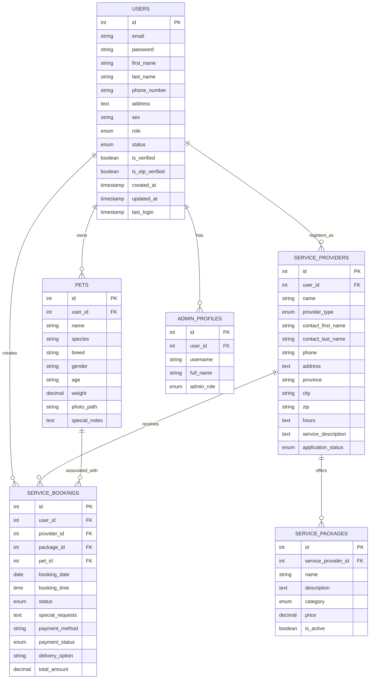

# Rainbow Paws User Relationships - Entity Relationship Model

This document outlines the three user types in the Rainbow Paws system and their relationships with each other and other key entities.

## User Types Overview

The Rainbow Paws application has three distinct user types, all stored in the central `users` table but differentiated by their `role` attribute:

1. **Fur Parent** - Pet owners who use the platform to book pet cremation services
2. **Business** - Service providers (primarily cremation centers) that offer services to fur parents
3. **Admin** - System administrators who manage the platform

## Entity Descriptions

### 1. Users (Central Entity)

The `users` table is the central entity that stores all user accounts regardless of their role.

**Attributes:**
- `id` (PK) - Unique identifier for each user
- `email` - User's email address (unique)
- `password` - Hashed password
- `first_name` - User's first name
- `last_name` - User's last name
- `phone_number` - Contact phone number
- `address` - Physical address
- `sex` - User's gender
- `role` - User role (fur_parent, business, admin)
- `status` - Account status (active, inactive, suspended, restricted)
- `is_verified` - Account verification status
- `is_otp_verified` - OTP verification status
- `created_at` - Account creation timestamp
- `updated_at` - Last update timestamp
- `last_login` - Last login timestamp

### 2. Fur Parent (Role-specific)

Fur parents are represented by the `role = 'fur_parent'` in the users table.

**Additional Relationships:**
- Owns pets (stored in the `pets` table)
- Creates service bookings (stored in the `service_bookings` table)

### 3. Business/Service Provider (Role-specific)

Businesses are represented by the `role = 'business'` in the users table, with additional details stored in the `service_providers` table.

**Additional Attributes (in service_providers table):**
- `id` (PK) - Unique identifier for each service provider
- `user_id` (FK) - References users.id
- `name` - Business name
- `provider_type` - Type of provider (cremation, memorial, veterinary)
- `contact_first_name` - Contact person's first name
- `contact_last_name` - Contact person's last name
- `phone` - Business phone number
- `address` - Business address
- `province` - Business province
- `city` - Business city
- `zip` - Business zip code
- `hours` - Business hours
- `service_description` - Description of services offered
- `application_status` - Status of business application (pending, declined, approved, restricted)
- `verification_date` - Date of verification
- `verification_notes` - Notes from verification process
- Various document paths for verification documents

**Additional Relationships:**
- Offers service packages (stored in the `service_packages` table)
- Receives service bookings (stored in the `service_bookings` table)

### 4. Admin (Role-specific)

Admins are represented by the `role = 'admin'` in the users table, with additional details stored in the `admin_profiles` table.

**Additional Attributes (in admin_profiles table):**
- `id` (PK) - Unique identifier for each admin profile
- `user_id` (FK) - References users.id
- `username` - Admin username
- `full_name` - Admin's full name
- `admin_role` - Admin role type (super_admin, admin, moderator)
- `created_at` - Profile creation timestamp
- `updated_at` - Last update timestamp

## Key Related Entities

### 1. Pets

**Attributes:**
- `id` (PK) - Unique identifier for each pet
- `user_id` (FK) - References users.id (owner)
- `name` - Pet's name
- `species` - Pet's species
- `breed` - Pet's breed
- `gender` - Pet's gender
- `age` - Pet's age
- `weight` - Pet's weight
- `photo_path` - Path to pet's photo
- `special_notes` - Special notes about the pet

### 2. Service Bookings

**Attributes:**
- `id` (PK) - Unique identifier for each booking
- `user_id` (FK) - References users.id (fur parent)
- `provider_id` (FK) - References service_providers.id
- `package_id` (FK) - References service_packages.id
- `pet_id` (FK) - References pets.id
- `booking_date` - Date of booking
- `booking_time` - Time of booking
- `status` - Booking status (pending, confirmed, in_progress, completed, cancelled)
- `special_requests` - Special requests for the booking
- `payment_method` - Method of payment
- `payment_status` - Status of payment (not_paid, partially_paid, paid)
- `delivery_option` - Delivery option (pickup, delivery)
- `delivery_address` - Delivery address
- `delivery_distance` - Delivery distance
- `delivery_fee` - Delivery fee
- `total_amount` - Total amount for the booking

## Entity Relationship Diagram

## Relationship Descriptions  N= many

1. **Users to Pets (1:N)**
   - A fur parent (user with role='fur_parent') can own multiple pets
   - Each pet belongs to exactly one fur parent

2. **Users to Service Providers (1:1)**
   - A business user (user with role='business') can register exactly one service provider
   - Each service provider is associated with exactly one business user

3. **Users to Service Bookings (1:N)**
   - A fur parent can create multiple service bookings
   - Each service booking is created by exactly one fur parent

4. **Users to Admin Profiles (1:1)**
   - An admin user (user with role='admin') has exactly one admin profile
   - Each admin profile belongs to exactly one admin user

5. **Service Providers to Service Packages (1:N)**
   - A service provider can offer multiple service packages
   - Each service package is offered by exactly one service provider

6. **Service Providers to Service Bookings (1:N)**
   - A service provider can receive multiple service bookings
   - Each service booking is received by exactly one service provider

7. **Pets to Service Bookings (1:N)**
   - A pet can be associated with multiple service bookings
   - Each service booking is associated with exactly one pet

## Authentication and Access Control

The system implements role-based access control:

1. **Fur Parents (role='fur_parent')**
   - Can manage their own pets
   - Can browse service providers and packages
   - Can create and manage bookings
   - Can view their booking history

2. **Businesses (role='business')**
   - Can manage their service provider profile
   - Can create and manage service packages
   - Can manage bookings received from fur parents
   - Can view booking history and reports

3. **Admins (role='admin')**
   - Can manage all users, service providers, and bookings
   - Can approve or decline business applications
   - Can moderate the platform
   - Access level depends on admin_role (super_admin, admin, moderator)

## Database Implementation Notes

1. The central `users` table uses the `role` field to differentiate between user types
2. Role-specific details are stored in separate tables (admin_profiles, service_providers)
3. Foreign key constraints ensure referential integrity
4. The system uses soft deletion for most entities to preserve historical data
