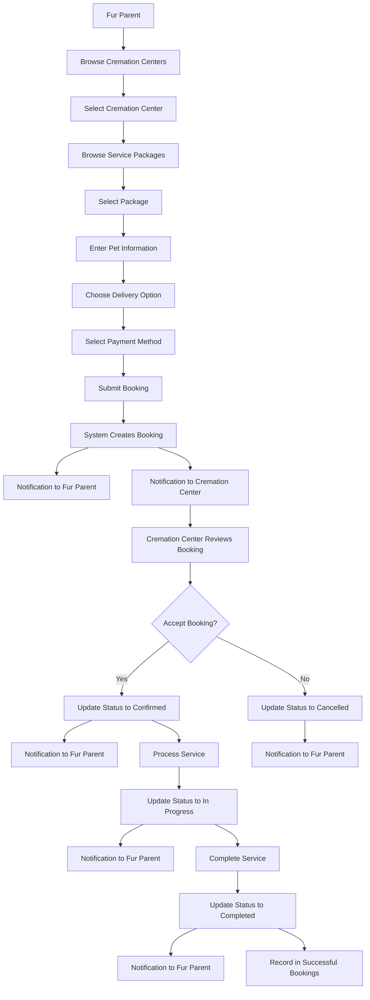
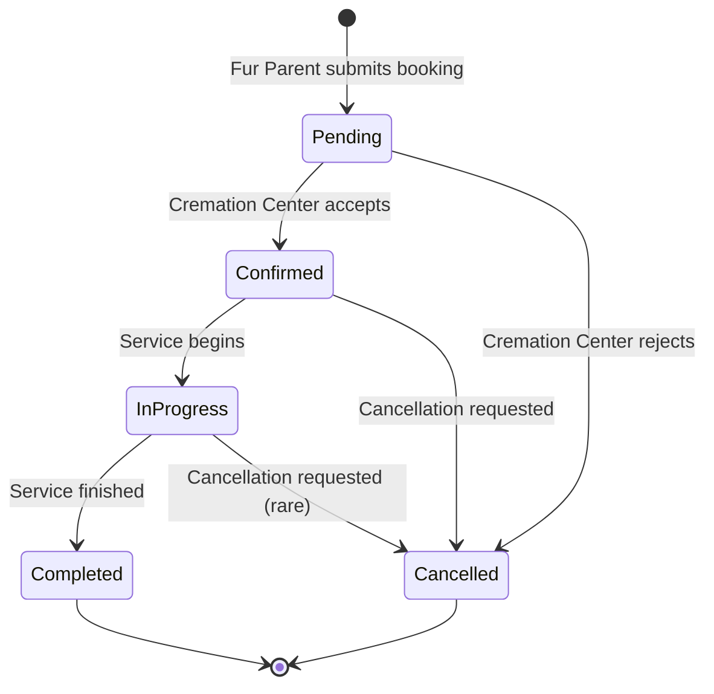
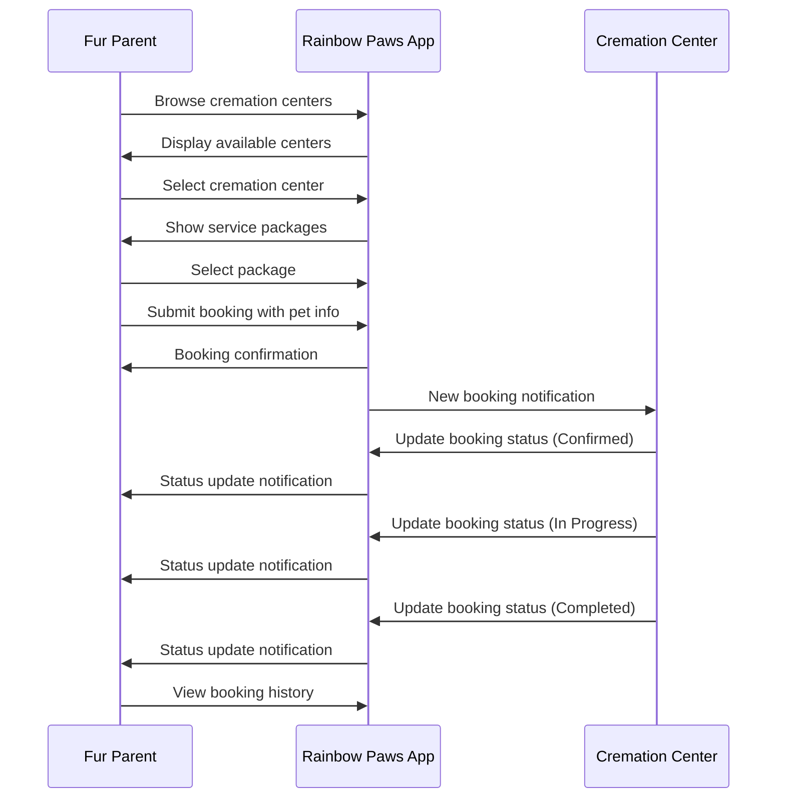
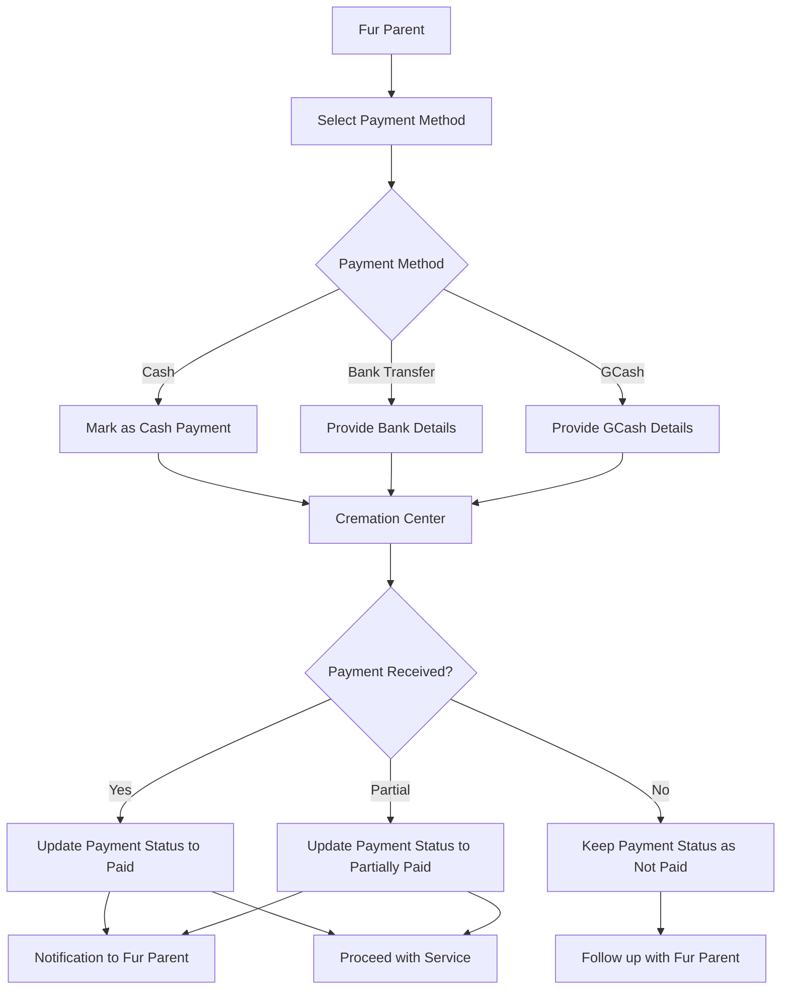
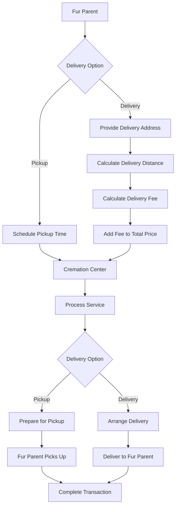
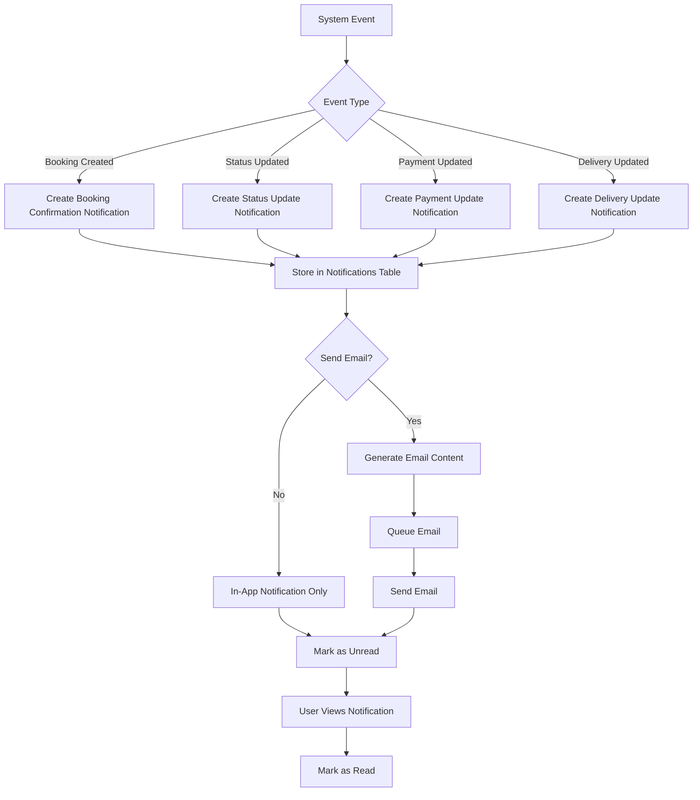

# Booking Flow Diagram

This document provides a visual representation of the booking flow between fur parents and cremation centers in the Rainbow Paws application.

## Booking Process Flow

## Booking Status Lifecycle

## Communication Flow

## Payment Processing Flow

## Delivery Process Flow

## Notification System Flow

These diagrams provide a visual representation of the various flows and interactions between fur parents and cremation centers in the Rainbow Paws application.
