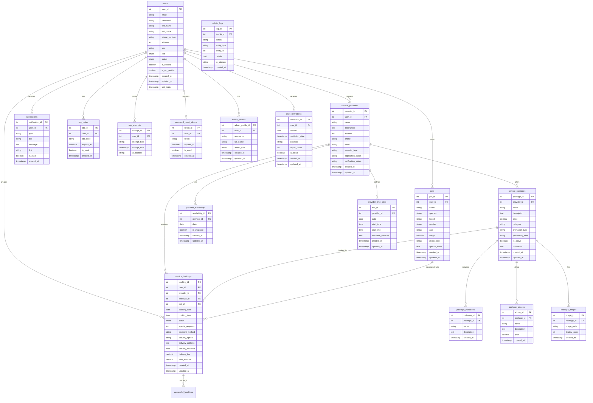

# Rainbow Paws Database ERD (Entity Relationship Diagram)

This document provides a visual representation of the Rainbow Paws database structure using Mermaid diagram syntax.

## Core Database Tables and Relationships

## Notes on Relationships

- **One-to-Many (1:N)** relationships are represented with the `||--o{` notation
- **Many-to-Many (N:M)** relationships would typically be implemented with junction tables
- **Foreign Keys** follow the naming convention of `table_name_id` (e.g., `user_id`, `provider_id`)

## Primary Key Naming Convention

As per your preference, the ERD uses more descriptive primary key names (e.g., `user_id` instead of just `id`) for better readability. This makes it clearer which ID is being referenced in relationships.

## Reading the Diagram

- Each box represents a table in the database
- Lines between boxes represent relationships
- The notation on the lines indicates the type of relationship
- Inside each box are the columns of the table
- PK indicates Primary Key
- FK indicates Foreign Key
