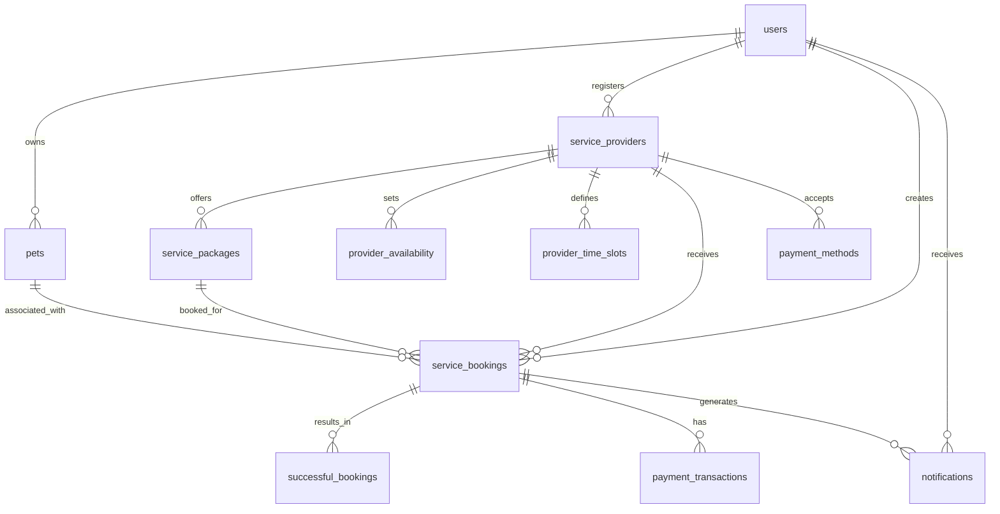

# Database Tables for User-Cremation Center Interaction

This document outlines the database tables involved in the interaction between fur parents and cremation centers in the Rainbow Paws application.

## Table of Contents

1. [Core Tables](#core-tables)
2. [Booking-Related Tables](#booking-related-tables)
3. [Communication Tables](#communication-tables)
4. [Availability and Scheduling Tables](#availability-and-scheduling-tables)
5. [Payment-Related Tables](#payment-related-tables)
6. [Table Relationships](#table-relationships)

## Core Tables

### `users`

Stores information about all users, including fur parents and cremation center owners.

```sql
CREATE TABLE `users` (
  `id` int(11) NOT NULL AUTO_INCREMENT,
  `email` varchar(100) NOT NULL,
  `password` varchar(255) NOT NULL,
  `first_name` varchar(50) NOT NULL,
  `last_name` varchar(50) NOT NULL,
  `phone_number` varchar(20) DEFAULT NULL,
  `address` text DEFAULT NULL,
  `sex` varchar(20) DEFAULT NULL,
  `role` enum('fur_parent','business','admin') NOT NULL DEFAULT 'fur_parent',
  `status` enum('active','inactive','suspended','restricted') NOT NULL DEFAULT 'active',
  `is_verified` tinyint(1) NOT NULL DEFAULT 0,
  `is_otp_verified` tinyint(1) NOT NULL DEFAULT 0,
  `created_at` timestamp NOT NULL DEFAULT current_timestamp(),
  `updated_at` timestamp NOT NULL DEFAULT current_timestamp() ON UPDATE current_timestamp(),
  `last_login` timestamp NULL DEFAULT NULL,
  PRIMARY KEY (`id`),
  UNIQUE KEY `email` (`email`)
) ENGINE=InnoDB DEFAULT CHARSET=utf8mb4 COLLATE=utf8mb4_general_ci;
```

### `pets`

Stores information about pets owned by fur parents.

```sql
CREATE TABLE `pets` (
  `id` int(11) NOT NULL AUTO_INCREMENT,
  `user_id` varchar(255) NOT NULL,
  `name` varchar(255) NOT NULL,
  `species` varchar(100) NOT NULL,
  `breed` varchar(255) DEFAULT NULL,
  `gender` varchar(50) DEFAULT NULL,
  `age` varchar(50) DEFAULT NULL,
  `weight` decimal(8,2) DEFAULT NULL,
  `photo_path` varchar(255) DEFAULT NULL,
  `special_notes` text DEFAULT NULL,
  `created_at` timestamp NOT NULL DEFAULT current_timestamp(),
  `updated_at` timestamp NOT NULL DEFAULT current_timestamp() ON UPDATE current_timestamp(),
  PRIMARY KEY (`id`),
  KEY `user_id` (`user_id`)
) ENGINE=InnoDB DEFAULT CHARSET=utf8mb4 COLLATE=utf8mb4_general_ci;
```

### `service_providers`

Stores information about cremation centers and other service providers.

```sql
CREATE TABLE `service_providers` (
  `id` int(11) NOT NULL AUTO_INCREMENT,
  `user_id` int(11) NOT NULL,
  `name` varchar(255) NOT NULL,
  `description` text DEFAULT NULL,
  `address` text DEFAULT NULL,
  `phone` varchar(20) DEFAULT NULL,
  `email` varchar(100) DEFAULT NULL,
  `provider_type` varchar(50) DEFAULT 'cremation',
  `application_status` varchar(50) DEFAULT 'pending',
  `verification_status` varchar(50) DEFAULT 'pending',
  `created_at` timestamp NOT NULL DEFAULT current_timestamp(),
  `updated_at` timestamp NOT NULL DEFAULT current_timestamp() ON UPDATE current_timestamp(),
  PRIMARY KEY (`id`),
  KEY `user_id` (`user_id`),
  CONSTRAINT `service_providers_ibfk_1` FOREIGN KEY (`user_id`) REFERENCES `users` (`id`) ON DELETE CASCADE
) ENGINE=InnoDB DEFAULT CHARSET=utf8mb4 COLLATE=utf8mb4_general_ci;
```

### `service_packages`

Stores information about the service packages offered by cremation centers.

```sql
CREATE TABLE `service_packages` (
  `id` int(11) NOT NULL AUTO_INCREMENT,
  `service_provider_id` int(11) NOT NULL,
  `name` varchar(255) NOT NULL,
  `description` text DEFAULT NULL,
  `price` decimal(10,2) NOT NULL,
  `category` varchar(50) DEFAULT 'standard',
  `cremation_type` varchar(50) DEFAULT NULL,
  `processing_time` varchar(50) DEFAULT '2-3 days',
  `is_active` tinyint(1) DEFAULT 1,
  `conditions` text DEFAULT NULL,
  `created_at` timestamp NOT NULL DEFAULT current_timestamp(),
  `updated_at` timestamp NOT NULL DEFAULT current_timestamp() ON UPDATE current_timestamp(),
  PRIMARY KEY (`id`),
  KEY `service_provider_id` (`service_provider_id`),
  CONSTRAINT `service_packages_ibfk_1` FOREIGN KEY (`service_provider_id`) REFERENCES `service_providers` (`id`) ON DELETE CASCADE
) ENGINE=InnoDB DEFAULT CHARSET=utf8mb4 COLLATE=utf8mb4_general_ci;
```

## Booking-Related Tables

### `service_bookings`

Stores information about bookings made by fur parents for cremation services.

```sql
CREATE TABLE `service_bookings` (
  `id` int(11) NOT NULL AUTO_INCREMENT,
  `user_id` int(11) NOT NULL,
  `provider_id` int(11) NOT NULL,
  `package_id` int(11) NOT NULL,
  `pet_id` int(11) DEFAULT NULL,
  `booking_date` date DEFAULT NULL,
  `booking_time` time DEFAULT NULL,
  `status` enum('pending','confirmed','in_progress','completed','cancelled') DEFAULT 'pending',
  `special_requests` text DEFAULT NULL,
  `pet_name` varchar(255) DEFAULT NULL,
  `pet_type` varchar(255) DEFAULT NULL,
  `pet_image_url` varchar(255) DEFAULT NULL,
  `cause_of_death` varchar(255) DEFAULT NULL,
  `payment_method` varchar(50) DEFAULT 'cash',
  `payment_status` enum('not_paid','partially_paid','paid') DEFAULT 'not_paid',
  `delivery_option` varchar(50) DEFAULT 'pickup',
  `delivery_address` text DEFAULT NULL,
  `delivery_distance` float DEFAULT 0,
  `delivery_fee` decimal(10,2) DEFAULT 0.00,
  `price` decimal(10,2) NOT NULL,
  `created_at` timestamp NOT NULL DEFAULT current_timestamp(),
  `updated_at` timestamp NOT NULL DEFAULT current_timestamp() ON UPDATE current_timestamp(),
  PRIMARY KEY (`id`),
  KEY `user_id` (`user_id`),
  KEY `provider_id` (`provider_id`),
  KEY `package_id` (`package_id`),
  KEY `pet_id` (`pet_id`),
  CONSTRAINT `service_bookings_ibfk_1` FOREIGN KEY (`user_id`) REFERENCES `users` (`id`) ON DELETE CASCADE,
  CONSTRAINT `service_bookings_ibfk_2` FOREIGN KEY (`provider_id`) REFERENCES `service_providers` (`id`) ON DELETE CASCADE,
  CONSTRAINT `service_bookings_ibfk_3` FOREIGN KEY (`package_id`) REFERENCES `service_packages` (`id`) ON DELETE CASCADE,
  CONSTRAINT `service_bookings_ibfk_4` FOREIGN KEY (`pet_id`) REFERENCES `pets` (`id`) ON DELETE SET NULL
) ENGINE=InnoDB DEFAULT CHARSET=utf8mb4 COLLATE=utf8mb4_general_ci;
```

### `successful_bookings`

Stores information about completed or cancelled bookings for financial tracking.

```sql
CREATE TABLE `successful_bookings` (
  `id` int(11) NOT NULL AUTO_INCREMENT,
  `booking_id` int(11) NOT NULL,
  `service_package_id` int(11) NOT NULL,
  `user_id` int(11) NOT NULL,
  `provider_id` int(11) NOT NULL,
  `transaction_amount` decimal(10,2) NOT NULL,
  `payment_date` timestamp NOT NULL DEFAULT current_timestamp(),
  `payment_status` enum('completed','cancelled') DEFAULT 'completed',
  PRIMARY KEY (`id`),
  KEY `booking_id` (`booking_id`),
  KEY `service_package_id` (`service_package_id`),
  KEY `user_id` (`user_id`),
  KEY `provider_id` (`provider_id`),
  CONSTRAINT `successful_bookings_ibfk_1` FOREIGN KEY (`booking_id`) REFERENCES `service_bookings` (`id`) ON DELETE CASCADE,
  CONSTRAINT `successful_bookings_ibfk_2` FOREIGN KEY (`service_package_id`) REFERENCES `service_packages` (`id`) ON DELETE CASCADE,
  CONSTRAINT `successful_bookings_ibfk_3` FOREIGN KEY (`user_id`) REFERENCES `users` (`id`) ON DELETE CASCADE,
  CONSTRAINT `successful_bookings_ibfk_4` FOREIGN KEY (`provider_id`) REFERENCES `service_providers` (`id`) ON DELETE CASCADE
) ENGINE=InnoDB DEFAULT CHARSET=utf8mb4 COLLATE=utf8mb4_general_ci;
```

## Communication Tables

### `notifications`

Stores notifications for users, including booking updates and status changes.

```sql
CREATE TABLE `notifications` (
  `id` int(11) NOT NULL AUTO_INCREMENT,
  `user_id` int(11) NOT NULL,
  `title` varchar(255) NOT NULL,
  `message` text NOT NULL,
  `type` varchar(50) DEFAULT 'info',
  `link` varchar(255) DEFAULT NULL,
  `is_read` tinyint(1) DEFAULT 0,
  `created_at` timestamp NOT NULL DEFAULT current_timestamp(),
  PRIMARY KEY (`id`),
  KEY `user_id` (`user_id`),
  KEY `is_read` (`is_read`),
  CONSTRAINT `notifications_ibfk_1` FOREIGN KEY (`user_id`) REFERENCES `users` (`id`) ON DELETE CASCADE
) ENGINE=InnoDB DEFAULT CHARSET=utf8mb4 COLLATE=utf8mb4_general_ci;
```

### `email_queue`

Stores emails to be sent to users, including booking confirmations and status updates.

```sql
CREATE TABLE `email_queue` (
  `id` int(11) NOT NULL AUTO_INCREMENT,
  `to_email` varchar(255) NOT NULL,
  `subject` varchar(255) NOT NULL,
  `html` text NOT NULL,
  `text` text DEFAULT NULL,
  `from_email` varchar(255) DEFAULT NULL,
  `cc` varchar(255) DEFAULT NULL,
  `bcc` varchar(255) DEFAULT NULL,
  `attachments` text DEFAULT NULL,
  `status` enum('pending','sent','failed') DEFAULT 'pending',
  `attempts` int(11) DEFAULT 0,
  `last_attempt` timestamp NULL DEFAULT NULL,
  `created_at` timestamp NOT NULL DEFAULT current_timestamp(),
  PRIMARY KEY (`id`),
  KEY `status` (`status`),
  KEY `created_at` (`created_at`)
) ENGINE=InnoDB DEFAULT CHARSET=utf8mb4 COLLATE=utf8mb4_general_ci;
```

## Availability and Scheduling Tables

### `provider_availability`

Stores the availability of cremation centers on specific dates.

```sql
CREATE TABLE `provider_availability` (
  `id` int(11) NOT NULL AUTO_INCREMENT,
  `provider_id` int(11) NOT NULL,
  `date` date NOT NULL,
  `is_available` tinyint(1) DEFAULT 1,
  `created_at` timestamp NOT NULL DEFAULT current_timestamp(),
  `updated_at` timestamp NOT NULL DEFAULT current_timestamp() ON UPDATE current_timestamp(),
  PRIMARY KEY (`id`),
  UNIQUE KEY `provider_date_unique` (`provider_id`,`date`),
  CONSTRAINT `provider_availability_ibfk_1` FOREIGN KEY (`provider_id`) REFERENCES `service_providers` (`id`) ON DELETE CASCADE
) ENGINE=InnoDB DEFAULT CHARSET=utf8mb4 COLLATE=utf8mb4_general_ci;
```

### `provider_time_slots`

Stores the specific time slots available for bookings on a given date.

```sql
CREATE TABLE `provider_time_slots` (
  `id` int(11) NOT NULL AUTO_INCREMENT,
  `provider_id` int(11) NOT NULL,
  `date` date NOT NULL,
  `start_time` time NOT NULL,
  `end_time` time NOT NULL,
  `available_services` text DEFAULT NULL,
  `created_at` timestamp NOT NULL DEFAULT current_timestamp(),
  `updated_at` timestamp NOT NULL DEFAULT current_timestamp() ON UPDATE current_timestamp(),
  PRIMARY KEY (`id`),
  KEY `provider_id` (`provider_id`),
  KEY `date` (`date`),
  CONSTRAINT `provider_time_slots_ibfk_1` FOREIGN KEY (`provider_id`) REFERENCES `service_providers` (`id`) ON DELETE CASCADE
) ENGINE=InnoDB DEFAULT CHARSET=utf8mb4 COLLATE=utf8mb4_general_ci;
```

## Payment-Related Tables

### `payment_methods`

Stores information about payment methods accepted by cremation centers.

```sql
CREATE TABLE `payment_methods` (
  `id` int(11) NOT NULL AUTO_INCREMENT,
  `provider_id` int(11) NOT NULL,
  `method_name` varchar(50) NOT NULL,
  `account_name` varchar(255) DEFAULT NULL,
  `account_number` varchar(255) DEFAULT NULL,
  `instructions` text DEFAULT NULL,
  `is_active` tinyint(1) DEFAULT 1,
  `created_at` timestamp NOT NULL DEFAULT current_timestamp(),
  `updated_at` timestamp NOT NULL DEFAULT current_timestamp() ON UPDATE current_timestamp(),
  PRIMARY KEY (`id`),
  KEY `provider_id` (`provider_id`),
  CONSTRAINT `payment_methods_ibfk_1` FOREIGN KEY (`provider_id`) REFERENCES `service_providers` (`id`) ON DELETE CASCADE
) ENGINE=InnoDB DEFAULT CHARSET=utf8mb4 COLLATE=utf8mb4_general_ci;
```

### `payment_transactions`

Stores information about payment transactions for bookings.

```sql
CREATE TABLE `payment_transactions` (
  `id` int(11) NOT NULL AUTO_INCREMENT,
  `booking_id` int(11) NOT NULL,
  `amount` decimal(10,2) NOT NULL,
  `payment_method` varchar(50) NOT NULL,
  `transaction_reference` varchar(255) DEFAULT NULL,
  `status` enum('pending','completed','failed') DEFAULT 'pending',
  `transaction_date` timestamp NOT NULL DEFAULT current_timestamp(),
  PRIMARY KEY (`id`),
  KEY `booking_id` (`booking_id`),
  CONSTRAINT `payment_transactions_ibfk_1` FOREIGN KEY (`booking_id`) REFERENCES `service_bookings` (`id`) ON DELETE CASCADE
) ENGINE=InnoDB DEFAULT CHARSET=utf8mb4 COLLATE=utf8mb4_general_ci;
```

## Table Relationships

The following diagram illustrates the relationships between the tables involved in the interaction between fur parents and cremation centers:



This diagram shows how the various tables are related to each other in the context of the interaction between fur parents and cremation centers. The key relationships are:

1. Users (fur parents) own pets and create bookings
2. Service providers (cremation centers) offer service packages and receive bookings
3. Service bookings are associated with pets, service packages, and service providers
4. Notifications are generated for both fur parents and cremation centers based on booking events
5. Payment transactions are associated with service bookings
6. Successful bookings record completed or cancelled bookings for financial tracking
